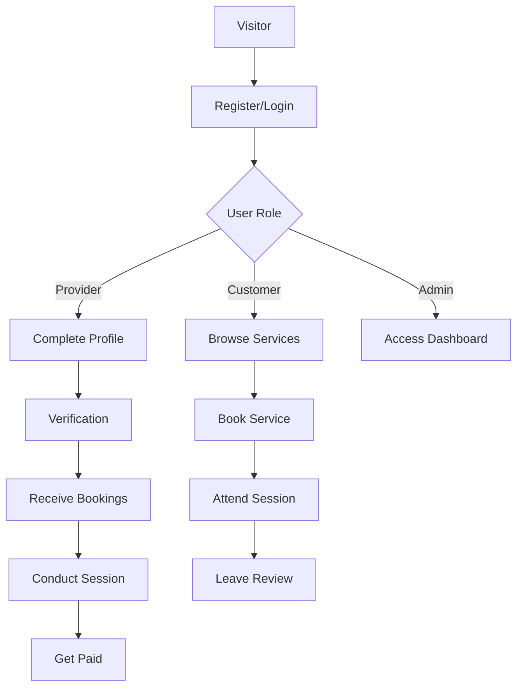
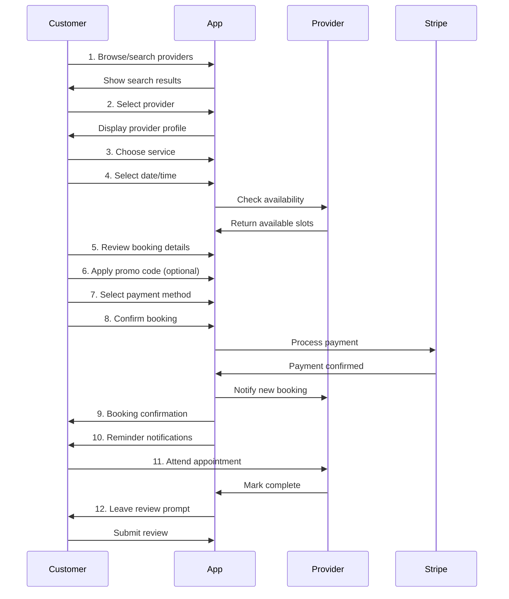
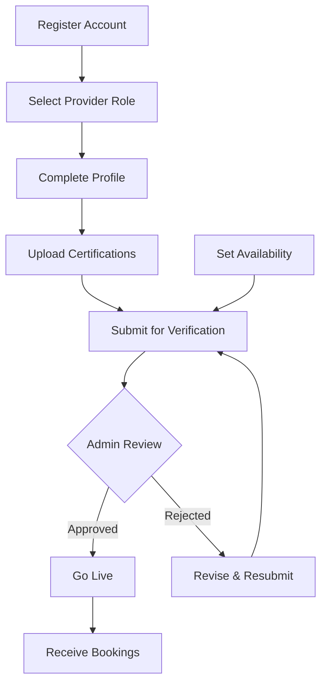
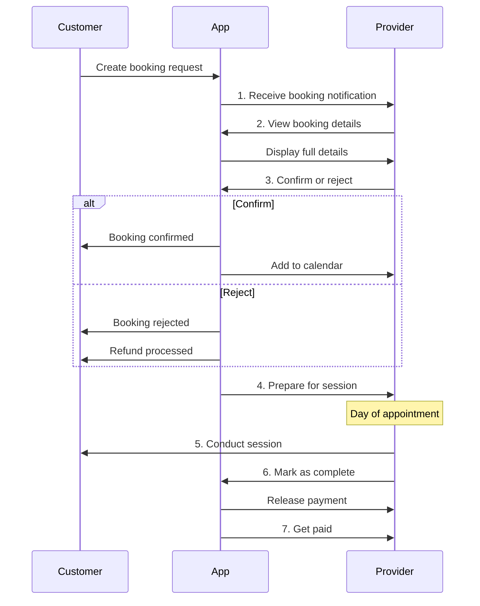
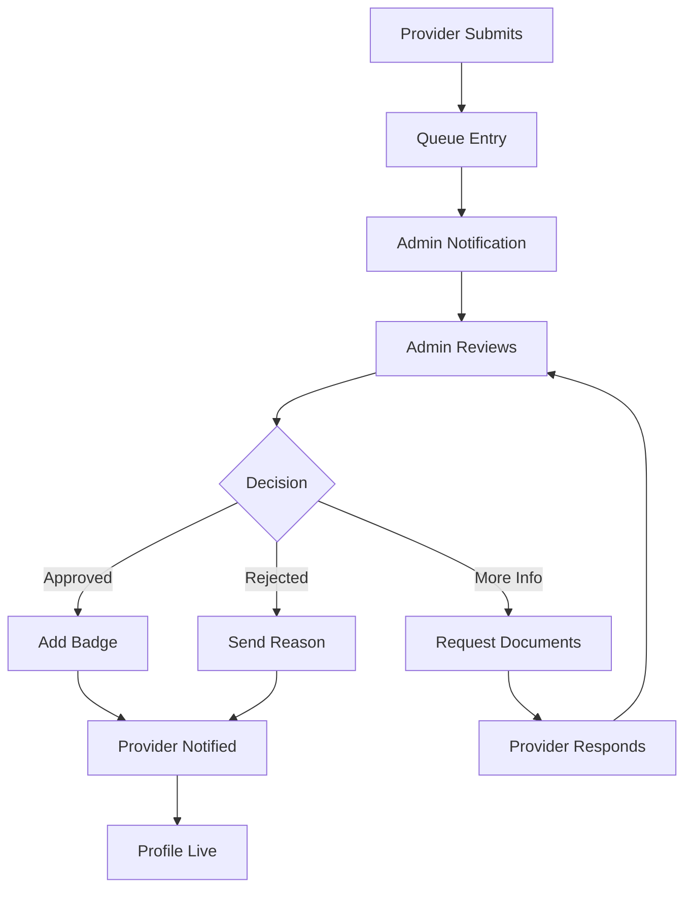
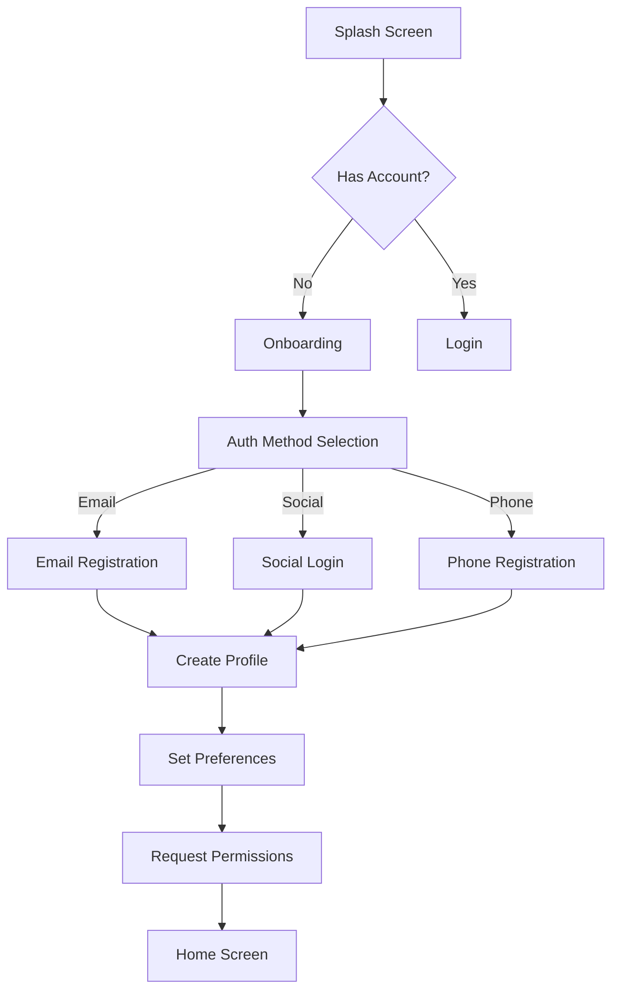
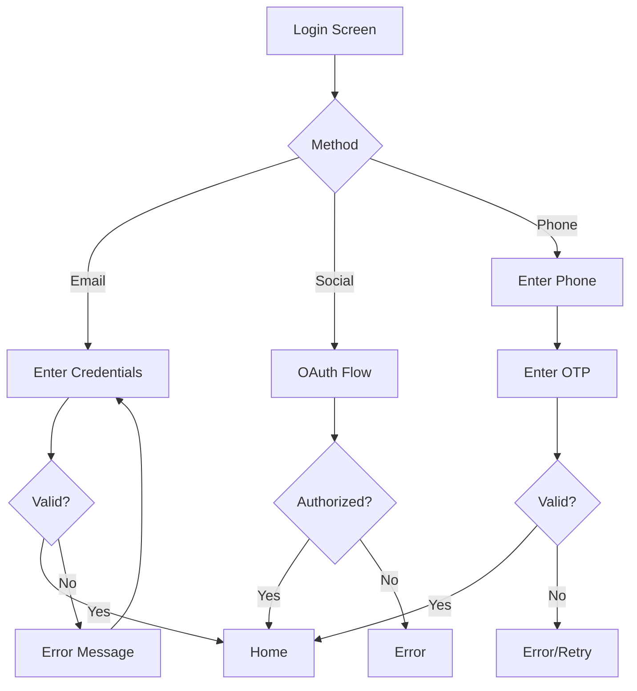
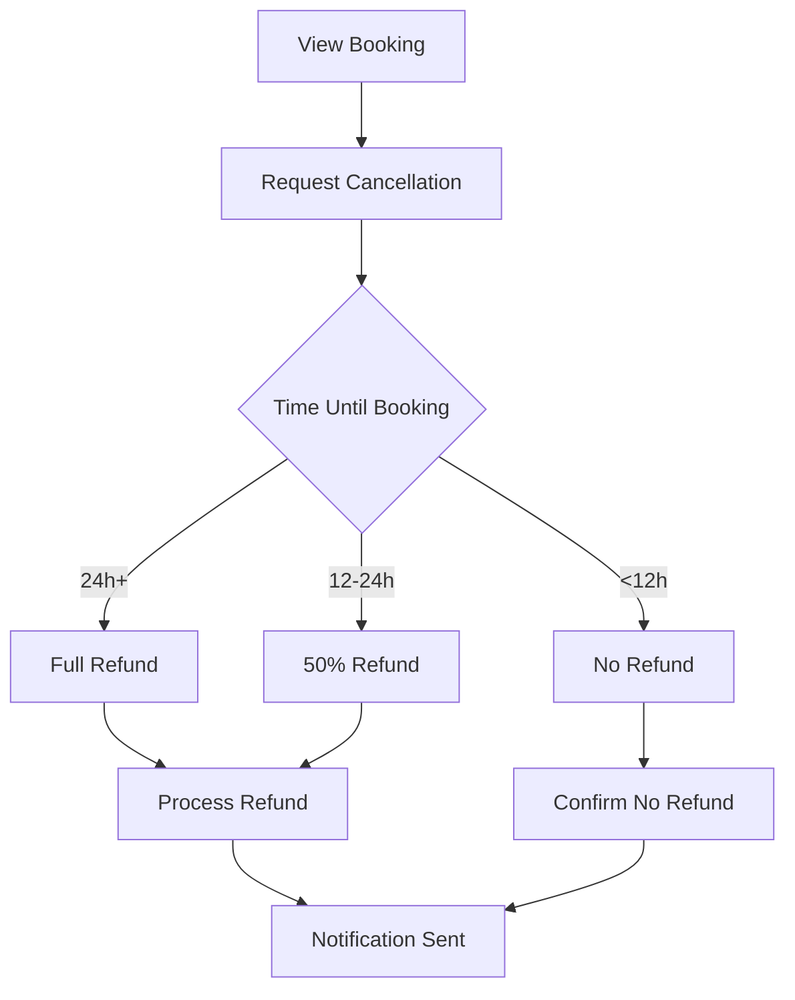

# User Flows

## Table of Contents
- [Overview](#overview)
- [Customer Booking Flow](#customer-booking-flow)
- [Provider Onboarding Flow](#provider-onboarding-flow)
- [Provider Booking Management](#provider-booking-management)
- [Admin Verification Flow](#admin-verification-flow)
- [User Registration Flow](#user-registration-flow)
- [Authentication Flow](#authentication-flow)
- [Profile Management Flow](#profile-management-flow)
- [Payment Flow](#payment-flow)
- [Cancellation & Refund Flow](#cancellation--refund-flow)

---

## Overview

This document outlines the complete user journeys for different roles within the VFit platform. Each flow describes the step-by-step experience from start to finish.

---

## Customer Booking Flow

### High-Level Flow

### Detailed Steps

#### 1. Browse and Search Providers

1. **Access Search**
   - Customer taps "Search" tab or quick action on home
   - Search interface loads with filters

2. **Apply Filters** (Optional)
   - Select category (Fitness, Wellness, Beauty, etc.)
   - Set price range
   - Choose availability (today, this week, flexible)
   - Set location radius
   - Filter by rating, home service, language

3. **View Results**
   - Scroll through provider cards
   - See key info: photo, name, rating, price, distance
   - Tap "View Profile" for details

#### 2. Select Provider and View Profile

1. **Profile Overview**
   - Hero image/header
   - Name, verification badge, rating
   - Short bio and specialties

2. **Detailed Information**
   - Full bio and experience
   - Certifications (verified/unverified)
   - Portfolio/gallery
   - Services offered with prices
   - Customer reviews

3. **Actions**
   - "Book Now" button
   - "Contact Provider" (pre-booking)
   - Save to favorites
   - Share profile

#### 3. Choose Service

1. **Service Selection**
   - List of available services
   - Price and duration for each
   - Description of what's included

2. **Select Service Type**
   - In-venue (at provider's location)
   - Home service (customer's location)
   - Virtual (online session)
   - Outdoor (park, etc.)

#### 4. Select Date and Time

1. **Calendar View**
   - Monthly calendar with availability
   - Green dots indicate available days

2. **Time Selection**
   - Available time slots displayed
   - Slot duration matches service
   - Real-time availability check

3. **Address Input** (Home service only)
   - Select saved address or add new
   - Validate within service radius

#### 5. Review Booking Details

1. **Booking Summary**
   - Service name and type
   - Date, time, duration
   - Provider name
   - Location/address
   - Price breakdown

2. **Add Notes** (Optional)
   - Special requests
   - Health considerations
   - Access instructions

#### 6. Apply Promo Code (Optional)

1. **Enter Code**
   - Input field for promo code
   - "Apply" button

2. **Validation**
   - Check code validity
   - Display discount amount
   - Update total price

#### 7. Select Payment Method

1. **Payment Options**
   - Saved credit/debit cards
   - Add new card
   - Wallet balance
   - Points redemption

2. **Payment Configuration**
   - Pay full amount or deposit only
   - Confirm payment details

#### 8. Confirm and Pay

1. **Final Review**
   - Complete booking summary
   - Cancellation policy notice
   - Terms acceptance

2. **Processing**
   - Secure Stripe payment processing
   - Loading indicator

3. **Confirmation**
   - Success screen with booking details
   - Add to calendar option
   - Booking reference number

#### 9. Receive Confirmation

- Push notification
- Email confirmation with details
- SMS reminder (if enabled)
- In-app booking card

#### 10. Get Reminder Notifications

- **24 hours before**: Upcoming booking reminder
- **1 hour before**: Final reminder with directions
- **15 minutes before**: Check-in prompt

#### 11. Attend Appointment

- Arrive at location / Join virtual meeting
- Provider checks in customer (QR code or manual)
- Session conducted

#### 12. Leave Review

- **Prompt**: 1 hour after scheduled end
- **Rating**: 1-5 stars
- **Review**: Written feedback (optional)
- **Photos**: Before/after images (optional)
- **Submit**: Review published after moderation

---

## Provider Onboarding Flow

### High-Level Flow

### Detailed Steps

#### 1. Register as Provider

1. **Account Creation**
   - Register with email/phone/social
   - Select "I want to offer services"
   - Agree to provider terms

2. **Basic Profile**
   - Full name
   - Profile photo (professional)
   - Contact information

#### 2. Select User Type

1. **Category Selection**
   - Choose primary category:
     - Fitness (Personal Trainer, Yoga, etc.)
     - Wellness (Nutritionist, Massage, etc.)
     - Beauty (Hairstylist, Makeup, etc.)
     - Mental Health (Psychologist, Coach, etc.)
     - Education (Tutor, Language, etc.)

2. **Specialty Selection**
   - Choose specialties/tags
   - Add custom specialties

#### 3. Complete Profile

1. **Professional Information**
   - Professional bio (500 chars)
   - Short bio/tagline (100 chars)
   - Years of experience
   - Languages spoken

2. **Service Area** (Home service)
   - Enable/disable home service
   - Set service radius (km)
   - Set travel fee (if applicable)

3. **Portfolio** (Optional)
   - Upload work samples
   - Before/after photos
   - Video introduction

#### 4. Upload Certifications

1. **Add Certifications**
   - Certificate name
   - Issuing organization
   - Issue date
   - Expiry date (if applicable)
   - Upload document (PDF/image)

2. **Education History**
   - Degree/certification
   - Institution
   - Field of study
   - Years attended

3. **Submit Documents**
   - Review all documents
   - Submit for verification

#### 5. Set Availability

1. **Weekly Schedule**
   - Set working hours per day
   - Mark unavailable days
   - Set buffer time between bookings

2. **Exception Dates**
   - Block holidays
   - Mark vacation time
   - One-off unavailability

3. **Advance Settings**
   - Minimum advance notice
   - Maximum advance booking window
   - Same-day booking toggle

#### 6. Add Services

1. **Create Services**
   - Service name
   - Description
   - Duration (minutes)
   - Price
   - Service type (in-person, virtual, etc.)

2. **Service Options**
   - Set deposit requirement
   - Package deals (e.g., 5 sessions)
   - Cancellation policy override

#### 7. Submit for Verification

1. **Review Application**
   - Preview provider profile
   - Verify all required fields
   - Check document uploads

2. **Submit**
   - Agree to provider terms
   - Submit application
   - Receive confirmation email

#### 8. Admin Reviews

1. **Document Verification**
   - Admin reviews certifications
   - Validates credentials
   - Checks photo quality

2. **Decision**
   - **Approved**: Verification badge added
   - **Rejected**: Reason provided, resubmission requested

#### 9. Approved and Live

- Profile goes live
- Appears in search results
- Can receive bookings
- Welcome email with tips

---

## Provider Booking Management

### High-Level Flow

### Detailed Steps

#### 1. Receive Booking Notification

1. **Notification Types**
   - Push notification (immediate)
   - Email notification
   - In-app notification badge

2. **Notification Content**
   - Customer name
   - Service requested
   - Date and time
   - Quick action buttons (Accept/Decline)

#### 2. View Booking Details

1. **Booking Card**
   - Customer info (name, photo)
   - Service details
   - Date, time, duration
   - Location (with map)
   - Customer notes
   - Payment status

2. **Customer History**
   - Past bookings with this customer
   - Previous notes
   - Review history

3. **Actions**
   - Confirm booking
   - Reject booking
   - Message customer
   - Reschedule

#### 3. Confirm or Reject

**Confirm Booking:**
1. Tap "Confirm"
2. Add provider notes (optional)
3. Booking status changes to "Confirmed"
4. Customer receives confirmation
5. Added to provider calendar

**Reject Booking:**
1. Tap "Decline"
2. Select reason:
   - Not available
   - Outside service area
   - Service not offered
   - Other (specify)
3. Optionally suggest alternative time
4. Customer receives rejection with reason
5. Automatic refund if paid

#### 4. Prepare for Session

1. **Pre-Session Checklist**
   - Review customer notes
   - Prepare equipment/materials
   - Plan session content
   - Check location/directions

2. **Communication**
   - Message customer if needed
   - Confirm any last-minute details

#### 5. Conduct Session

1. **Check-In**
   - Customer arrives / joins virtual session
   - Provider verifies identity
   - Mark as "In Progress"

2. **Session Delivery**
   - Conduct service
   - Track time
   - Note any issues

#### 6. Mark as Complete

1. **Completion Actions**
   - Tap "Complete Session"
   - Add session notes (optional)
   - Add photos to portfolio (optional)

2. **Automatic Actions**
   - Booking status: "Completed"
   - Payment released to provider
   - Customer prompted for review

#### 7. Get Paid

1. **Earnings Calculation**
   - Service fee minus platform commission
   - Deposits transferred to wallet

2. **Payout Options**
   - Automatic weekly payout
   - Manual withdrawal request
   - Bank transfer setup

---

## Admin Verification Flow

### High-Level Flow

### Detailed Steps

#### 1. Provider Submits Verification

- Application enters verification queue
- Status: "Pending Verification"
- Timestamp logged

#### 2. Admin Receives Notification

1. **Notification Channels**
   - Dashboard notification
   - Email alert
   - Slack integration (optional)

2. **Queue Display**
   - List of pending verifications
   - Sort by submission date
   - Priority flags (expedited)

#### 3. Review Documents

1. **Review Checklist**
   - [ ] Profile completeness
   - [ ] Photo quality appropriate
   - [ ] Bio professional
   - [ ] Certifications valid
   - [ ] Documents authentic
   - [ ] Services appropriate

2. **Document Verification**
   - Open certification files
   - Check issuing organizations
   - Verify dates (not expired)
   - Cross-reference if needed

#### 4. Check Certifications

1. **Validation Steps**
   - Confirm certification legitimacy
   - Check accreditation status
   - Verify not expired
   - Match to claimed specialties

2. **Notes**
   - Add internal notes
   - Flag for senior review if needed

#### 5. Approve or Reject

**Approve:**
1. Click "Verify Provider"
2. Select verified certifications
3. Add welcome message (optional)
4. Provider receives approval notification
5. Verification badge added to profile

**Reject:**
1. Click "Reject Application"
2. Select rejection reason(s):
   - Incomplete profile
   - Insufficient credentials
   - Poor photo quality
   - Invalid documents
   - Other (specify)
3. Provide detailed feedback
4. Provider receives rejection with reasons
5. Can resubmit after corrections

**Request More Info:**
1. Click "Request Information"
2. Specify what's needed
3. Provider receives request
4. Resubmits updated info

#### 6. Provider Notified

- Email notification sent
- In-app notification
- Status updated on dashboard

---

## User Registration Flow

### Standard Registration

### Detailed Steps

#### 1. Splash Screen
- Animated logo
- Auto-advance to onboarding (first time) or auth (returning)

#### 2. Onboarding (First Launch)
- 4-slide carousel
- Feature highlights
- "Get Started" CTA

#### 3. Authentication Method

**Email Registration:**
1. Enter email
2. Create password (6+ chars)
3. Confirm password
4. Accept terms

**Social Login:**
1. Select provider (Google/Apple)
2. OAuth flow
3. Grant permissions

**Phone Registration:**
1. Enter phone number
2. Request OTP
3. Enter 6-digit code
4. Verify

#### 4. Create Profile
1. Full name
2. Date of birth
3. Profile photo (optional)
4. Preferred section (Fit/Fun/Life)

#### 5. Set Preferences
1. Preferred language
2. Notification preferences
3. Privacy settings

#### 6. Request Permissions
1. Location access
2. Push notifications
3. Photo access

#### 7. Home Screen
- Personalized dashboard
- Role-based content

---

## Authentication Flow

### Login Flow

### Password Reset Flow

1. Tap "Forgot Password"
2. Enter email address
3. Receive reset email
4. Click reset link
5. Create new password
6. Redirect to login

---

## Profile Management Flow

### Edit Profile

1. Navigate to Profile tab
2. Tap "Edit Profile"
3. Update fields:
   - Personal info
   - Contact details
   - Bio
   - Photos
4. Save changes
5. Confirmation toast

### Provider Profile Updates

1. Go to Provider Dashboard
2. Tap "Edit Profile"
3. Update sections:
   - Basic info
   - Services
   - Availability
   - Certifications
4. Submit changes
5. Live immediately (no re-verification for minor changes)

---

## Payment Flow

### Add Payment Method

1. Go to Wallet/Payment
2. Tap "Add Payment Method"
3. Enter card details
4. Stripe tokenization
5. Save securely
6. Confirmation

### Make Payment

1. Select booking
2. Choose payment method
3. Review amount
4. Confirm payment
5. 3D Secure if required
6. Success confirmation

### Wallet Management

1. View balance
2. Add funds
3. View transaction history
4. Set auto-reload (optional)

---

## Cancellation & Refund Flow

### Customer Cancellation

### Provider Cancellation

1. View booking
2. Select "Cancel Booking"
3. Provide reason
4. Suggest alternative (optional)
5. Confirm cancellation
6. Customer notified
7. Full refund issued automatically

### Refund Processing

1. Refund request initiated
2. Check against policy
3. Calculate refund amount
4. Process via Stripe
5. Update booking status
6. Notify parties
7. Refund arrives in 5-10 business days
