# VFit: dalla registrazione alla prenotazione

Come un **provider** (trainer) e un **cliente** passano dalla creazione dell'account a un appuntamento confermato, passo per passo, con uno screenshot di ogni schermata.

*English version: [signup-to-booking.md](signup-to-booking.md).*

| | |
|--------|----------------------------|
| **Registrato** | 30 settembre 2026 (seconda registrazione, dopo il passaggio responsive), sul backend di staging (`vfit-app-staging`), app compilata da `main` @ `9f9af27` |
| **Dispositivo** | Viewport mobile 390 × 844 (formato iPhone 12/13/14). Le schermate lunghe sono catturate a tutta altezza |
| **Tema** | Scuro |
| **Lingua** | Italiano (l'app è disponibile anche in inglese, spagnolo, francese e tedesco) |
| **Provider** | Stefano Longo, `journey.it.provider@vitfitdemo.dev` |
| **Cliente** | Francesca Riva, `journey.it.customer@vitfitdemo.dev` |
| **Prenotazione risultante** | `Yjj9j70g14gVAQzUJAMd`: Personal Training, ven 2 ott 2026, 10:00–11:00, 50 € |

Entrambi gli account sono stati creati da zero per questa guida. Niente è stato precaricato o simulato.

---

## I due percorsi in sintesi

I due percorsi si incontrano nella richiesta di prenotazione. Prima che un cliente possa prenotarlo, il provider deve essere attivo, con almeno un servizio attivo e con un prezzo.

| # | Provider (trainer) | Cliente |
|--|------------------|------------------|
| 1 | Apre la landing page → **Registrati come provider** | Apre la landing page → **Registrati come cliente** |
| 2 | Compila il modulo di registrazione e spunta **Voglio anche offrire servizi come professionista**, scegliendo i servizi che offre | Sceglie un metodo di registrazione (email, Google, Apple, telefono/SMS) e compila il modulo |
| 3 | Viene approvato subito: ruolo `provider`, verificato, orari predefiniti lun–ven 09:00–17:00, una bozza di servizio non attiva per ogni servizio scelto | Arriva sulla Home |
| 4 | Imposta il prezzo di una bozza e la attiva | Apre **Prenota un servizio** e trova il trainer (ricerca, categoria o **Vicino a me**) |
| 5 | Controlla la disponibilità e imposta una posizione per comparire nelle ricerche **Vicino a me** | Apre la pagina del trainer, sceglie un servizio, una data e un orario |
| 6 | | Rivede la prenotazione, accetta i termini e tocca **Conferma**. La prenotazione nasce come *richiesta* |
| 7 | Riceve la notifica **Nuova richiesta di prenotazione** e **conferma** la prenotazione | |
| 8 | Vede l'appuntamento in *Prossimi appuntamenti* | Riceve la notifica **Prenotazione accettata**. La prenotazione risulta **Confermata** |

**Stati della prenotazione coperti:** `requested` ("In attesa di conferma") → `accepted` ("Confermato"). Gli stati successivi (completata, annullata, recensita) non rientrano in questo documento.

**Pagamento:** in questa fase il cliente paga il trainer direttamente, di persona o come concordato (contanti, Satispay, bonifico). Nell'app non viene addebitato nulla. Dopo la sessione il trainer registra il pagamento.

---

## Parte A: percorso del provider

### A1. Landing page

Il visitatore apre l'app. La sezione principale offre due ingressi: **Registrati come cliente** e **Registrati come provider**. Il provider tocca **Registrati come provider**.


### A2. Modulo di registrazione (modalità provider)

**Registrati come provider** apre `/auth/register?as=provider`, direttamente sul modulo con email, con l'opzione professionista già spuntata. In alto ci sono il selettore della lingua e l'interruttore del tema chiaro / scuro / di sistema.

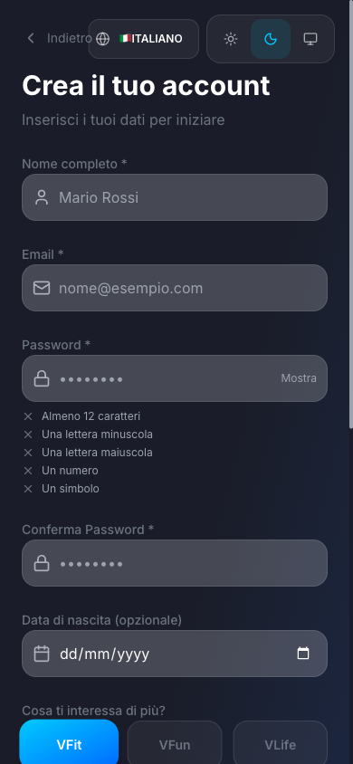

### A3. Dati personali

Il provider inserisce:

- **Nome completo** ed **Email** (obbligatori)
- **Password** e **Conferma Password**. L'elenco dei requisiti si aggiorna mentre si scrive: almeno 12 caratteri, una lettera minuscola, una maiuscola, un numero e un simbolo.
- **Data di nascita** (opzionale)
- **Cosa ti interessa di più?**: VFit, VFun o VLife (qui: VFit)

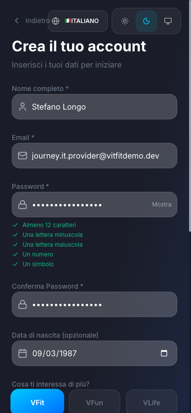

### A4. Opzione professionista e servizi offerti

Con **Voglio anche offrire servizi come professionista** spuntato, il provider sceglie i servizi che offre dal catalogo della piattaforma: prima una categoria (es. *Forza e Condizionamento*), poi uno o più servizi. Qui: **Personal Training** e **Functional Training**. Accetta i Termini di Servizio e la Privacy Policy e tocca **Crea account**.

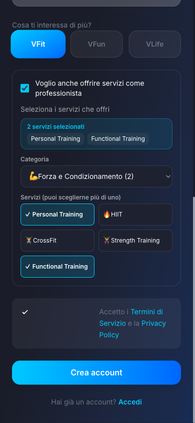

> **Cosa succede dietro le quinte.** L'approvazione automatica dei provider è attiva per impostazione predefinita (`systemSettings/providerOnboarding.autoApprove`, modificabile da `/admin/providers`), quindi la funzione `applyAsProvider` approva subito l'account:
> ruolo `provider`, profilo provider verificato, disponibilità predefinita lun–ven 09:00–17:00 e una **bozza di servizio non attiva a 0 €** per ogni servizio scelto. Se un admin disattiva l'approvazione automatica, la candidatura finisce invece in una coda di attesa.

### A5. Permessi

Dopo la registrazione l'app chiede la **Posizione** (per trovare palestre, eventi e servizi vicini) e le **Notifiche** (aggiornamenti sulle prenotazioni). Entrambe sono facoltative. Il provider può consentirle o toccare **Salta per ora**.

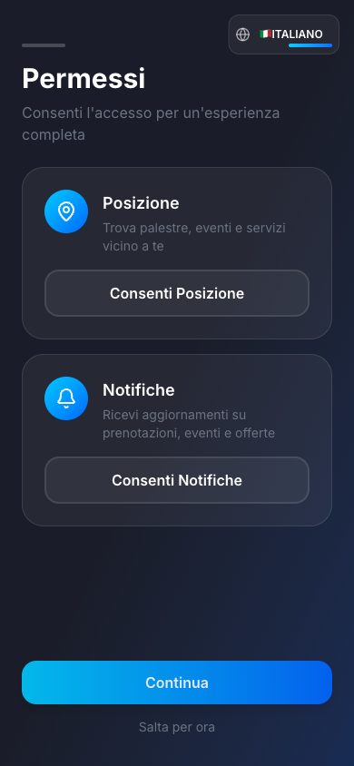

### A6. Dashboard del provider

Il provider arriva direttamente nel **Portale provider**. La dashboard conferma che è già prenotabile (*"Sei prenotabile lun–ven 9:00–17:00 — controlla i tuoi orari"*) e suggerisce di aggiungere una posizione. Il banner **Conferma la tua email**, sopra la barra *Portale provider*, chiede di aprire il link di verifica inviato per email. In questo percorso non blocca nulla.

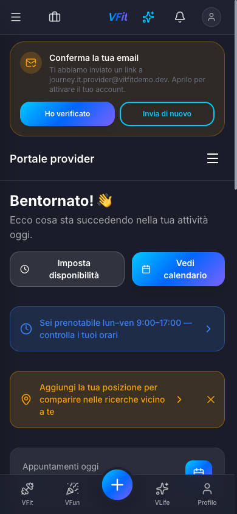

### A7. Servizi: le bozze create alla registrazione

**Portale provider → Servizi** elenca una bozza per ogni servizio scelto alla registrazione. Le bozze sono **Non attivo** a **0 €**, quindi i clienti non possono prenotarle finché il provider non imposta un prezzo.

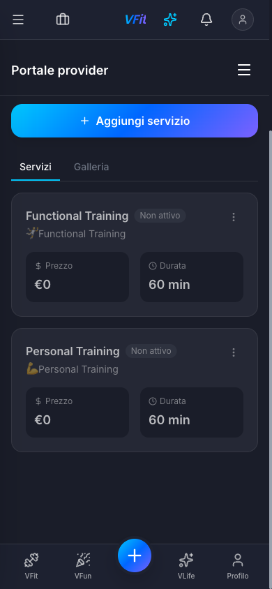

### A8. Aprire le azioni del servizio

Il menu **⋮** di un servizio offre **Modifica**, **Duplica**, **Attiva** ed **Elimina**. Il provider lo apre su *Personal Training* e tocca **Modifica**.

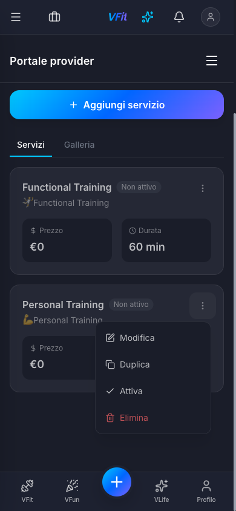

### A9. Prezzo e attivazione del servizio

In **Modifica servizio** il provider aggiunge una descrizione, imposta **Prezzo (€)** a **50** e lascia **Durata (min)** a **60**. Spunta **Servizio attivo** e tocca **Salva modifiche**.
(Con **Aggiungi servizio** si possono anche creare nuovi servizi, dal catalogo o personalizzati.)

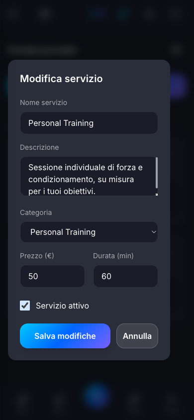

### A10. Il servizio è attivo

*Personal Training* ora mostra **50 € / 60 min** e la descrizione, senza il badge *Non attivo*. Il provider compare nei risultati di ricerca con **Da 50,00 €**.

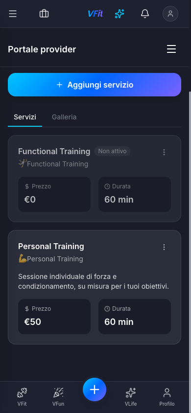

### A11. Disponibilità (controllo facoltativo)

**Portale provider → Disponibilità** mostra l'orario settimanale creato alla registrazione: dal lunedì al venerdì, una fascia al giorno (09:00–17:00), weekend liberi. Ci sono anche le impostazioni generali:

- **Tempo cuscinetto**: 15 minuti
- **Preavviso minimo**: 24 h prima
- **Max prenotazioni al giorno**: 8
- **Fuso orario**: Europe/Rome

**Eccezioni date** serve per ferie e modifiche puntuali.

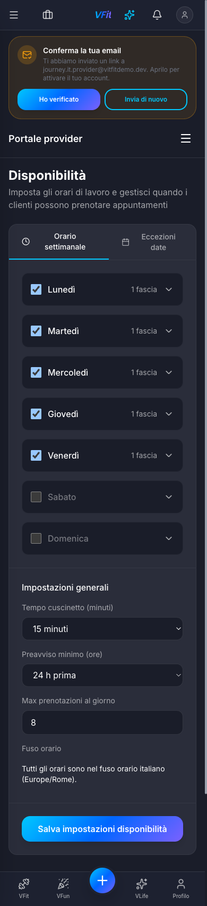

### A12. Posizione (consigliata)

**Portale provider → Posizione** imposta dove lavora il provider. Cerca un indirizzo (qui *Piazza Gae Aulenti, Milano*), sistema il segnaposto sulla mappa, controlla la **Città** e tocca **Salva posizione**. La conferma dice *"Posizione salvata: ora compari nelle ricerche vicino a te."* Viene salvata solo una posizione approssimata (circa 100 m).

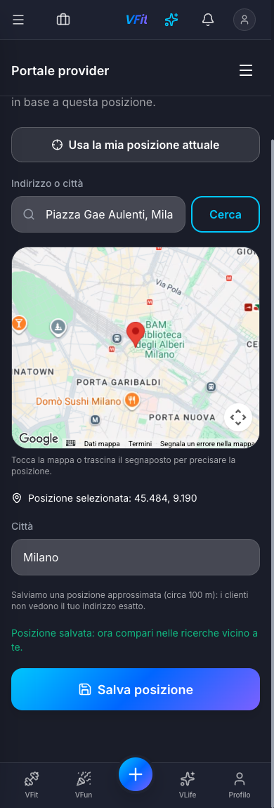

> I clienti possono trovare il provider cercandone il nome anche senza posizione. La posizione lo aggiunge ai risultati **Vicino a me** e mostra la distanza.

*Il provider è ora attivo. La [Parte B](#parte-b-percorso-del-cliente) mostra il cliente che lo prenota. Il lato provider riprende da A13.*

### A13. Notifica di nuova richiesta

Quando il cliente prenota, la campanella mostra un badge. **Notifiche** riporta *"Nuova richiesta di prenotazione — Francesca Riva ha richiesto Personal Training (ven 2 ott, 10:00). Accetta o rifiuta dall'app."*

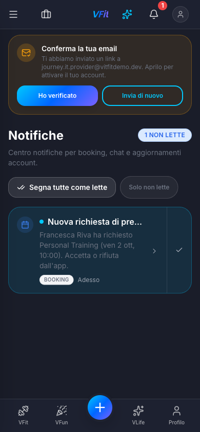

### A14. Prenotazioni: la richiesta in attesa di conferma

**Portale provider → Prenotazioni** mostra su telefono ogni prenotazione come una scheda: nome ed email del cliente, stato **IN ATTESA DI CONFERMA**, servizio e durata, data, ora e prezzo, con i pulsanti **Conferma** e **Rifiuta** sempre visibili. Le schede filtrano per Tutte, In attesa, Confermate, Completate e Cancellate; ci sono anche la ricerca per nome del cliente, **Filtri** ed **Esporta**.

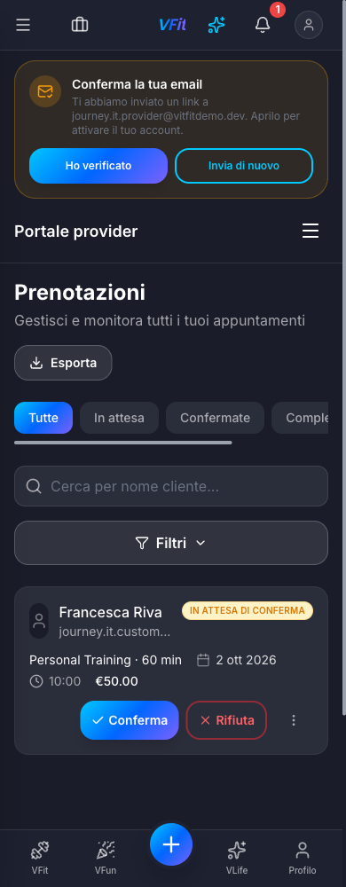

### A15. Confermare la prenotazione

Il provider tocca **Conferma**. Il pulsante mostra un indicatore di caricamento, poi la scheda passa a **CONFERMATO** e un avviso dice *"Prenotazione confermata: il cliente riceverà una notifica."* L'azione diventa **Completa**, da usare dopo la sessione.

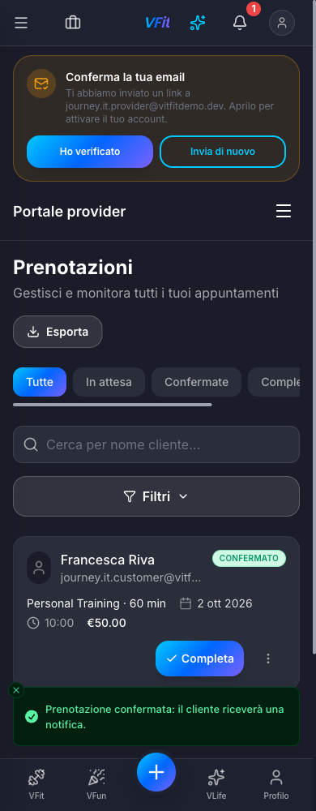

### A16. Dashboard: prossimo appuntamento

La dashboard ora conta **1** in *Prenotazioni settimana*. *Prossimi appuntamenti* elenca **2 ott · 10:00 · Francesca Riva · Personal Training · Confermato**, con il pulsante **Dettagli**.

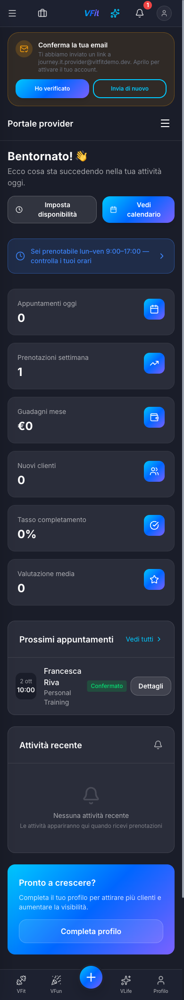

---

## Parte B: percorso del cliente

### B1. Landing page

Il visitatore tocca **Registrati come cliente**.

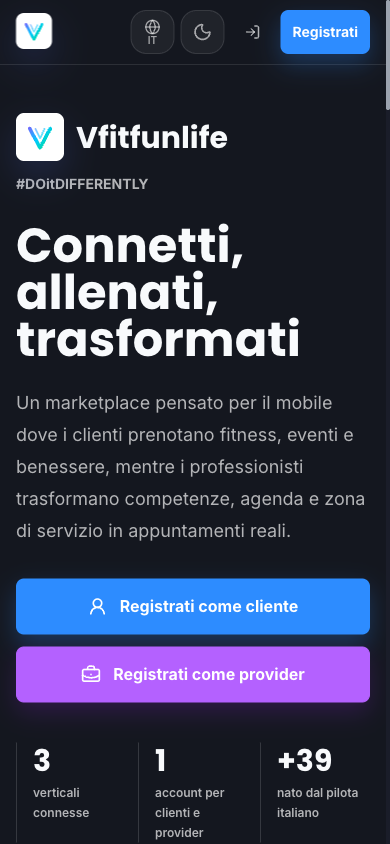

### B2. Scegliere come registrarsi

Il cliente sceglie come registrarsi: **Email e Password**, **Google**, **Apple** o **Telefono** (SMS). Questa guida usa l'email.

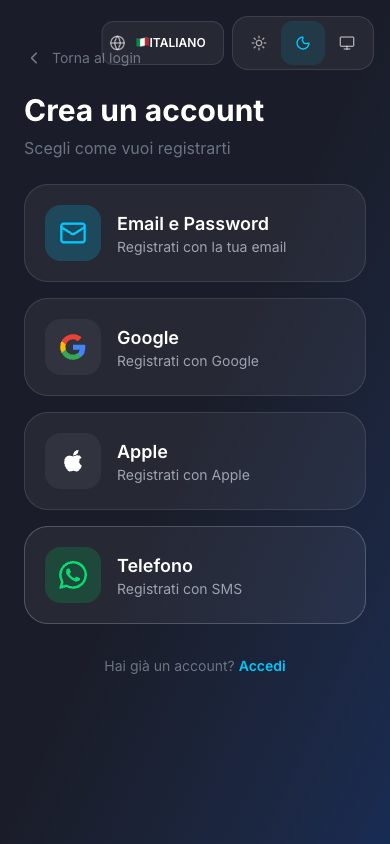

### B3. Modulo di registrazione

È lo stesso modulo usato dal provider, ma con l'opzione professionista **non spuntata**.

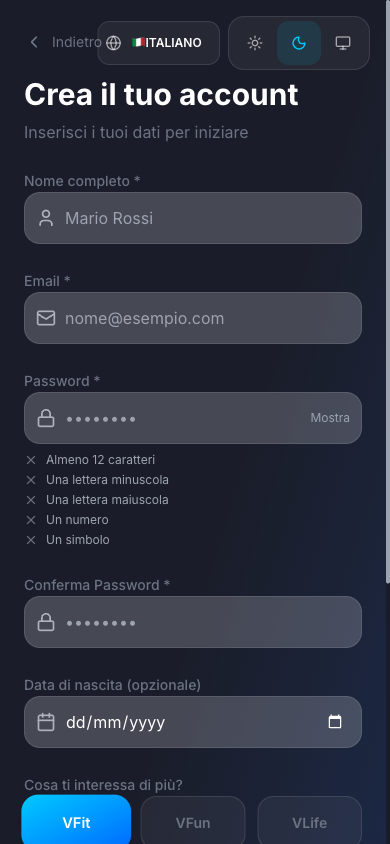

### B4. Compilare e creare l'account

Il cliente inserisce nome, email, una password che rispetta tutte e cinque le regole, la data di nascita (facoltativa) e l'interesse principale (VFit). Accetta i Termini di Servizio e la Privacy Policy e tocca **Crea account**.

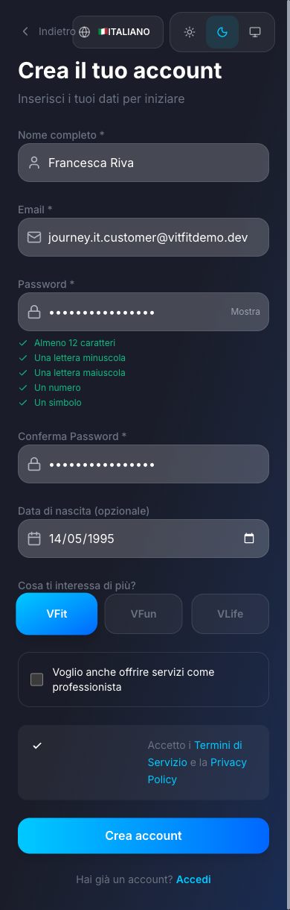

### B5. Permessi

È lo stesso passaggio facoltativo (Posizione e Notifiche) del provider. Il cliente tocca **Salta per ora**. Consentire qui la posizione fa funzionare **Vicino a me** con un tocco più avanti.


### B6. Home

Il cliente arriva sulla **Home**, con palestre e sedi, corsi attivi, la mappa VFit e i coach online. Compare lo stesso banner **Conferma la tua email**.

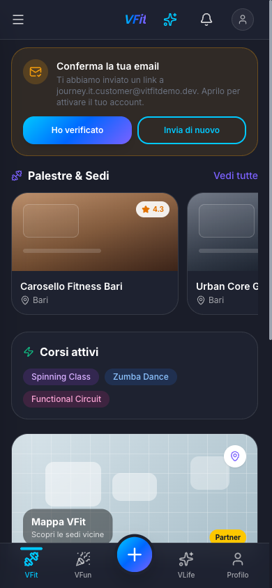

### B7. Prenota un servizio

Il pulsante **Prenota ora** (al centro della barra in basso) o **Cerca** apre **Prenota un servizio** (`/booking`). Il cliente può:

- cercare per nome del trainer o del servizio
- filtrare per categoria (Forza e Condizionamento, Cardio e Resistenza, Sport da Combattimento, Mente e Corpo, Danza e Gruppo, Terapia e Recupero, Nutrizione e Stile di Vita, Benessere Mentale) e con il pulsante filtri
- usare **Vicino a me** con un raggio (5 / 10 / 25 / 50 km / Tutti)
- passare dalla vista elenco alla vista mappa

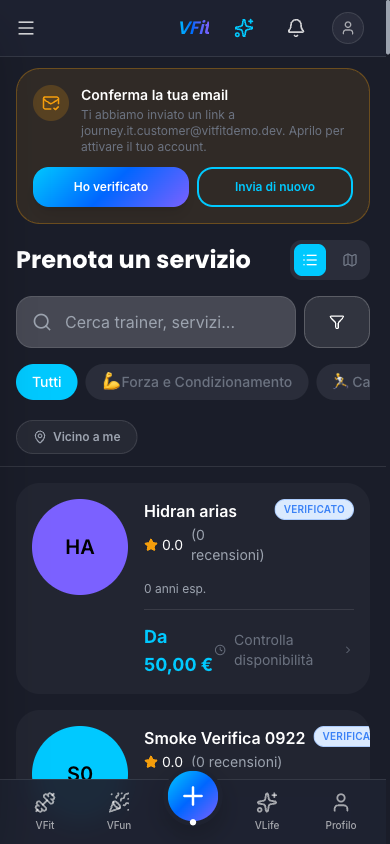

### B8. Trovare il trainer

Il cliente tocca **Vicino a me**, che usa la posizione del dispositivo (qui vicino a Porta Nuova, Milano) con un raggio predefinito di 25 km, e scrive il nome del trainer. **Stefano Longo** compare a **0.1 km**, **VERIFICATO**, **Da 50,00 €**. Tocca **Controlla disponibilità**.

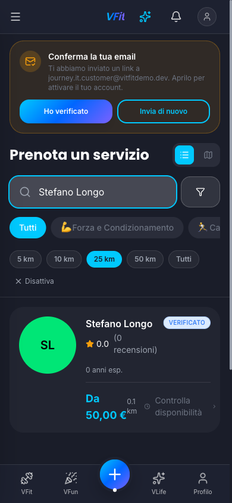

### B9. Pagina del trainer: scegliere un servizio

La pagina del trainer (`/book?providerId=…`) ha le schede **Servizi**, **Recensioni** e **Chi sono** e i pulsanti **Messaggio** e **Verifica disponibilità**. In *Seleziona un servizio* il cliente tocca **Seleziona** su *Personal Training (1 h, 50,00 €)*.

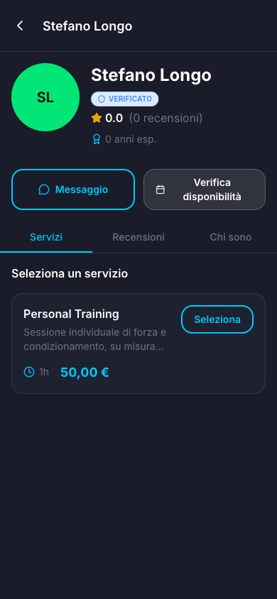

### B10. Scegliere la data

Il calendario si apre sul mese corrente. Il provider richiede 24 ore di preavviso, quindi il cliente passa a **ottobre** con la freccia › e tocca **venerdì 2**. I giorni non vengono disattivati in base alla disponibilità: un giorno senza orari liberi (un weekend, o domani quando il preavviso lo esclude) si apre con *"Nessun orario disponibile"*.

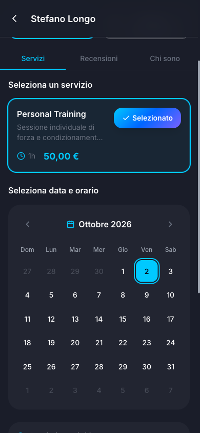

### B11. Scegliere l'orario

*Orari disponibili* elenca gli inizi liberi ogni 30 minuti, divisi in **Mattina** e **Pomeriggio** (ora di Europe/Rome). Il cliente sceglie **10:00**. In basso compare il riepilogo *Personal Training · ven 2 ott · 10:00*; tocca **Continua**.

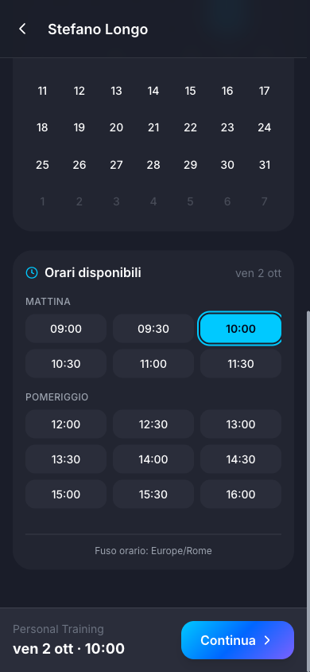

### B12. Conferma prenotazione

La schermata di conferma (`/booking/confirm`) mostra:

- trainer, servizio, data e ora (venerdì 2 ottobre · 10:00 · 60 min) e città (Milano)
- **Nota per il trainer (facoltativa)**, fino a 500 caratteri
- **Codice promozionale** e **Usa i miei punti** (100 punti = 1,00 €)
- **Riepilogo prezzi**: Servizio 50,00 €, Totale 50,00 €
- **Pagamento al trainer**: nell'app non si paga nulla; il cliente paga 50 € direttamente al trainer e guadagna +50 XP quando il trainer registra il pagamento dopo la sessione
- la casella obbligatoria **Termini di servizio** e **Politica di cancellazione** (*cancellazione gratuita entro 24 ore*)

Il cliente scrive una nota, spunta la casella e tocca **Conferma**.

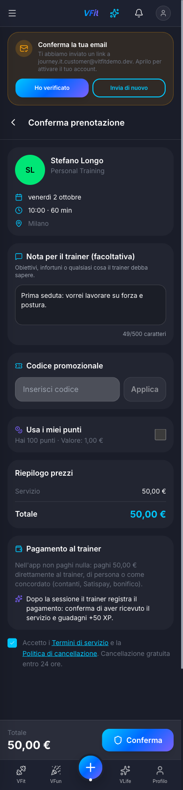

### B13. Richiesta inviata

L'app apre il dettaglio della prenotazione con un banner verde: *"Richiesta inviata, in attesa del trainer. Ti avviseremo appena il trainer risponde."*

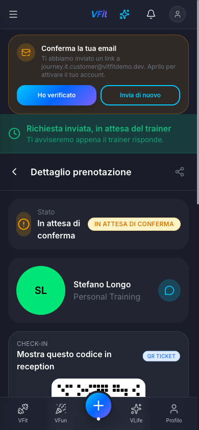

Il dettaglio della prenotazione mostra:

- lo stato **In attesa di conferma**
- nome del trainer e servizio, con un pulsante per scrivergli in chat
- un **QR TICKET** per il check-in da mostrare in reception
- data e ora, con **Aggiungi al calendario**
- la nota lasciata al trainer
- lo stato del pagamento **IN ATTESA**, il totale 50,00 €, **Scarica ricevuta**
- l'ID della prenotazione e **Annulla prenotazione**

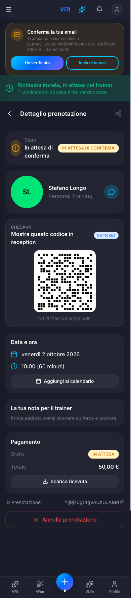

*Ora il provider accetta la richiesta (passi [A13–A15](#a13-notifica-di-nuova-richiesta)).*

### B14. Notifica di prenotazione accettata

Quando il trainer conferma, il cliente riceve *"Prenotazione accettata — Il trainer ha accettato la tua richiesta per Personal Training."*

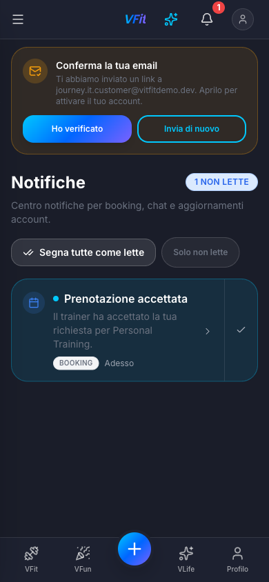

### B15. Le mie prenotazioni

**Le mie prenotazioni** (`/bookings`) ha le schede In arrivo, Passate e Annullate, più un pulsante di aggiornamento e **+ Nuova**. In *In arrivo* la sessione compare come **VFIT · CONFERMATO · Personal Training · Stefano Longo · 2 ott, 10:00**.

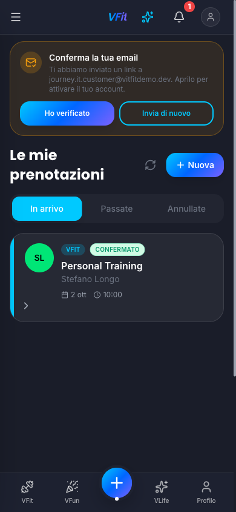

### B16. Dettaglio prenotazione: confermata

Il dettaglio ora mostra lo stato **Confermato**. Il QR per il check-in, l'esportazione nel calendario e la ricevuta restano disponibili, e le azioni ora sono **Riprogramma** e **Annulla prenotazione**.

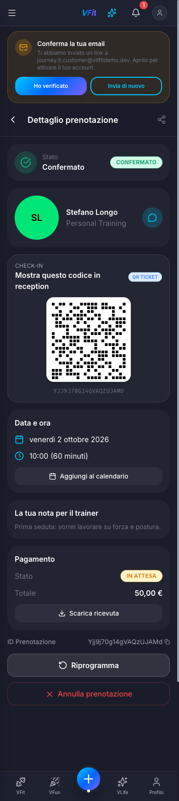

**Il percorso è completo:** entrambi gli account sono stati creati e l'appuntamento è prenotato e confermato da entrambe le parti.

---

## Cosa è cambiato rispetto alla prima registrazione

La prima registrazione (sempre il 30 settembre 2026, in tema chiaro) aveva trovato nove problemi; i problemi 1–7 e 9 sono stati corretti lo stesso giorno (commit `fa4ec61`). Questa registrazione conferma le correzioni visibili nel percorso:

- **Ricerca per nome**: un provider appena registrato si trova anche senza posizione.
- **Prenotazioni del provider su telefono**: sono schede con Conferma / Rifiuta / Completa sempre visibili, quindi A14–A16 sono ora mostrati a larghezza telefono invece che desktop.
- **Riscontro sulla conferma**: il pulsante mostra un indicatore di caricamento, la scheda passa subito a *Confermato* e un avviso lo conferma.
- **Nome del trainer**: compare nella scheda e nel dettaglio della prenotazione del cliente (avatar con le iniziali invece di "?").
- **Banner dell'email**: sta sopra la barra *Portale provider* invece che sotto.
- **Orario selezionato**: testo scuro sul colore della sezione.

Schermate diverse dalla prima registrazione: le schermate prenotazioni del provider (A14–A16) usano le schede mobile; *Le mie prenotazioni* ha tre schede (In arrivo, Passate, Annullate) più **+ Nuova** invece della scheda *Nuove*; il dettaglio di una prenotazione confermata aggiunge **Riprogramma**; il dettaglio ha un pulsante chat accanto al trainer.

## Problemi osservati durante questa registrazione

Nessuno di questi ha impedito la prenotazione.

| # | Gravità | Dove | Cosa è successo |
|--|--------|-----------|-------------------------------------|
| 1 | Media | Calendario di prenotazione (B10) | Tutti i giorni futuri sono attivi, anche i weekend e i giorni esclusi dal preavviso di 24 ore. Selezionandoli compare *"Nessun orario disponibile"*. I giorni senza orari liberi andrebbero disattivati. |
| 2 | Media | Modulo di registrazione, riga dei termini (A4, B4) | Il contenitore della casella occupa tutta la larghezza, quindi il testo *Accetto i Termini…* finisce nella metà destra del riquadro. Quando è spuntata, la casella perde lo sfondo e resta solo il segno di spunta. |
| 3 | Bassa | Prenotazioni del provider, italiano (A14) | Il prezzo appare come `€50.00` (formato inglese) invece di `50,00 €`. |
| 4 | Bassa | Schermate di registrazione, italiano | Il link **Indietro** / **Torna al login** finisce sotto il selettore della lingua a 390 px. |
| 5 | Bassa | Dettaglio prenotazione (B13) | Il badge *IN ATTESA DI CONFERMA* esce dal bordo destro della scheda di stato. |
| 6 | Bassa | Prenotazioni del provider (A14) | L'avatar del cliente è schiacciato in un ovale stretto. |
| 7 | Bassa | Prenota un servizio (B7, B8) | Il badge *VERIFICATO* viene tagliato sul bordo della scheda con i nomi lunghi. Nei risultati con la distanza, "0.1 km" va a capo tra il prezzo e *Controlla disponibilità*. |
| 8 | Bassa | Finestra Modifica servizio (A9) | La finestra non è centrata su telefono (16 px di margine a sinistra, circa 48 px a destra). Le etichette non sono collegate ai campi e manca `role="dialog"`. |
| 9 | Bassa | Dashboard del provider (A6, A16) | Un provider appena registrato viene accolto con *"Bentornato!"*. *Attività recente* resta vuota dopo una richiesta e una conferma. |
| 10 | Bassa | Testi italiani | Il tag delle notifiche resta *BOOKING* e la descrizione dice "per booking"; la stessa azione si chiama *Controlla disponibilità* nei risultati e *Verifica disponibilità* sulla pagina del trainer; lo stato annullato è *Cancellate* nel portale provider e *Annullate* per il cliente. |
| 11 | Bassa | Le mie prenotazioni (B15) | La freccia › della scheda sta sotto l'avatar, in basso a sinistra. |
| 12 | Info | Pagine provider | Il layout provider annida due landmark `<main>`. |
| 13 | Info | Staging | Su staging non arriva nessuna email di verifica (i secret email sono segnaposto per scelta), quindi il banner *Conferma la tua email* resta visibile. Non blocca registrazione, configurazione dei servizi o prenotazione. |
| 14 | Info | Mappa della posizione (A12) | La mappa Google resta in stile chiaro con il tema scuro. |

---

## Come ripetere questa guida

1. Staging accetta solo email in allowlist. Un superadmin le aggiunge prima da **Admin → Staging access** (`/admin/staging-access`), oppure vanno scritte in `stagingAllowlist/{email}` con l'Admin SDK.
2. Avviare l'app in locale contro staging con `npm run dev` (`.env.local` punta a `vfit-app-staging`). Il gate di staging è saltato su `localhost`, ma la registrazione viene comunque verificata sul server contro l'allowlist.
3. Impostare il tema scuro con l'interruttore del tema (oppure `localStorage['vfit.theme'] = 'dark'`) e l'italiano con il selettore della lingua (`localStorage['vfit.locale'] = 'it'`).
4. Seguire la Parte A, poi la Parte B, poi A13–A16 e B14–B16.
5. Rigenerare il file Word (pandoc + Pillow; gli screenshot sono dimensionati come nella prima registrazione, 844 px = 14,1 cm, massimo 20 cm):

   ```bash
   cd docs/user-journeys
   python3 build-docx.py signup-to-booking.it.md signup-to-booking.it.docx \
     "VFit — Dalla registrazione alla prenotazione" \
     "Provider e cliente, dalla creazione dell'account a un appuntamento confermato" it-IT
   ```
