# VFit: Signup-to-Booking User Journeys

How a **provider** (trainer) and a **customer** get from creating an account to a confirmed appointment, step by step, with a screenshot of every screen.

| | |
|--------|----------------------------|
| **Recorded** | 30 September 2026, against the staging backend (`vfit-app-staging`), app built from `main` @ `a79f758` |
| **Device** | Mobile viewport 390 × 844 (iPhone 12/13/14 size). The provider's booking-management screens are also shown at desktop width (1280 px) |
| **Language** | English (the app also ships in Italian, Spanish, French and German) |
| **Provider used** | Luca Bianchi, `journey.provider@vitfitdemo.dev` |
| **Customer used** | Giulia Verdi, `journey.customer@vitfitdemo.dev` |
| **Resulting booking** | `Q2scEOoU5bsCjsaqgB18`: Personal Training, Fri 2 Oct 2026, 10:00–11:00, €50 |

Both accounts were created fresh for this walkthrough. Nothing in it was seeded or mocked.

---

## The two journeys at a glance

The two journeys meet at the booking request. The provider must be live, with at least one active and priced service, before a customer can book them.

| # | Provider (trainer) | Customer |
|--|------------------|------------------|
| 1 | Opens the landing page → **Register as a provider** | Opens the landing page → **Register as a customer** |
| 2 | Fills in the signup form and ticks **I also want to offer services as a professional**, picking the services they offer | Chooses a signup method (email, Google, Apple, phone/SMS) and fills in the signup form |
| 3 | Is approved on the spot: role `provider`, verified, default Mon–Fri 09:00–17:00 hours, one inactive draft service per chosen category | Lands on Home |
| 4 | Sets a price on a draft service and activates it | Opens **Book a service**, finds the trainer (search, category or **Near me**) |
| 5 | Checks their availability and sets a location so they appear in **Near me** searches | Opens the trainer's page, picks a service, a date and a time slot |
| 6 | | Reviews the booking, accepts the terms and taps **Confirm**. The booking is created as a *request* |
| 7 | Gets a **New booking request** notification and **confirms** the booking | |
| 8 | Sees the appointment under *Upcoming Appointments* | Gets a **Booking accepted** notification. The booking shows as **Confirmed** |

**Booking status lifecycle covered here:** `requested` ("Awaiting confirmation") → `accepted` ("Confirmed"). The later statuses (completed, cancelled, reviewed) are outside the scope of this document.

**Payment:** at this stage customers pay the trainer directly, in person or as agreed (cash, Satispay, bank transfer). Nothing is charged in the app. After the session the trainer records the payment.

---

## Part A: Provider journey

### A1. Landing page

The visitor opens the app. The hero offers two entry points: **Register as a customer** and **Register as a provider**. The provider taps **Register as a provider**.

### A2. Signup form (provider mode)

**Register as a provider** opens `/auth/register?as=provider`. It goes straight to the email signup form, with the professional opt-in already ticked.

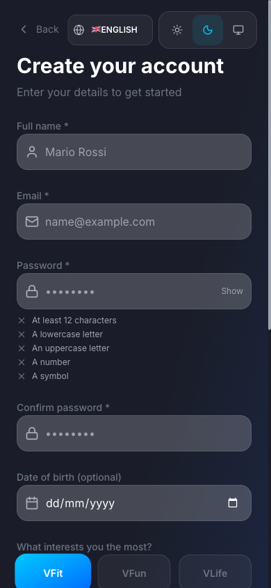

### A3. Personal details

The provider enters:

- **Full name** and **Email** (required)
- **Password** and **Confirm password**. The live checklist requires at least 12 characters, a lowercase letter, an uppercase letter, a number and a symbol.
- **Date of birth** (optional)
- **What interests you the most?**: VFit, VFun or VLife (here: VFit)

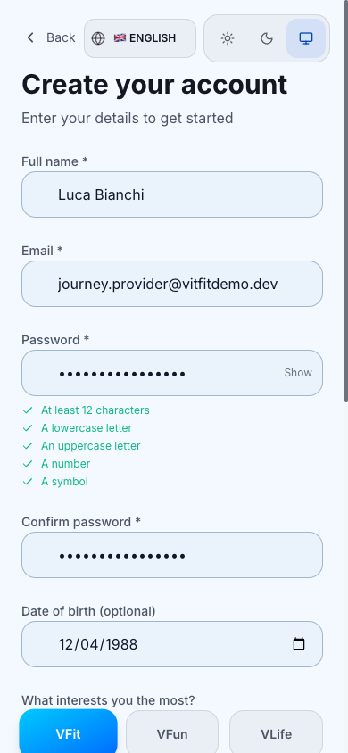

### A4. Professional opt-in and services offered

With **I also want to offer services as a professional** ticked, the provider picks the services they offer from the platform catalogue. They choose a category (e.g. *Strength & Conditioning*) and then one or more services. Here: **Personal Training** and **Functional Training**. They accept the Terms of Service and Privacy Policy and tap **Create account**.

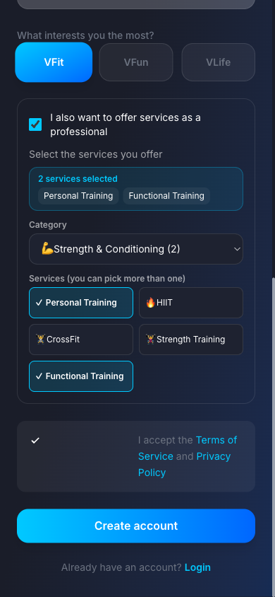

> **What happens behind the scenes.** Provider auto-approval is on by default (`systemSettings/providerOnboarding.autoApprove`, switchable on `/admin/providers`), so the `applyAsProvider` function approves the account immediately:
> role `provider`, verified provider profile, default Mon–Fri 09:00–17:00 availability, and one **inactive, €0 draft service** for each service picked. If an admin switches auto-approval off, the application goes to a pending queue instead.

### A5. Permissions

After signup the app asks for **Location** (to find nearby gyms, events and services) and **Notifications** (booking updates). Both are optional. The provider can allow them or tap **Skip for now**.

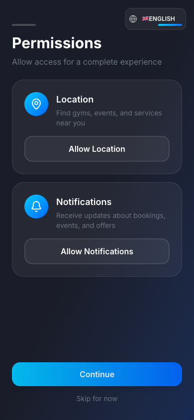

### A6. Provider dashboard

The provider lands directly in the **Provider portal**. The dashboard confirms they are already bookable (*"You're bookable Mon–Fri 9:00–17:00 — check your hours"*) and suggests adding a location. A **Confirm your email** banner asks them to click the verification link sent to their inbox. It does not block anything in this journey.

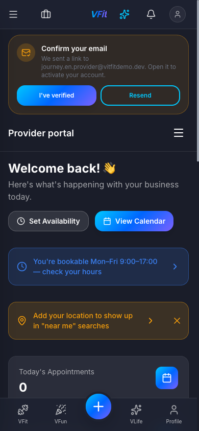

### A7. Services: the drafts created at signup

**Provider portal → Services** lists one draft per service chosen at signup. Drafts are **Inactive** at **€0**, so customers cannot book them until the provider sets a price.

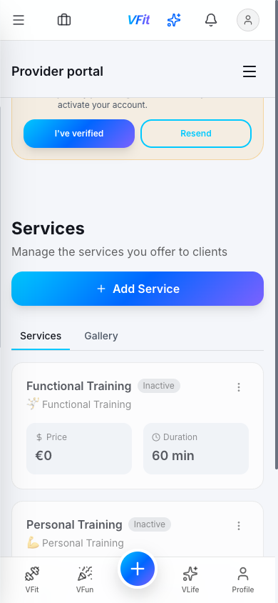

### A8. Open the service actions

The **⋮** menu on a service card offers **Edit**, **Duplicate**, **Activate** and **Delete**. The provider opens it on *Personal Training* and taps **Edit**. (The screenshot shows the same menu on the *Functional Training* draft, taken after *Personal Training* had been priced.)

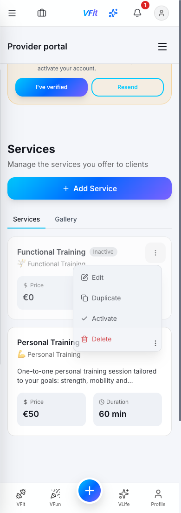

### A9. Price and activate the service

In **Edit Service** the provider adds a description, sets **Price (€)** to **50** and keeps **Duration** at **60 min**. They tick **Service is active** and tap **Save Changes**.
(New services can also be added with **Add Service**, either from the catalogue or as a custom service.)

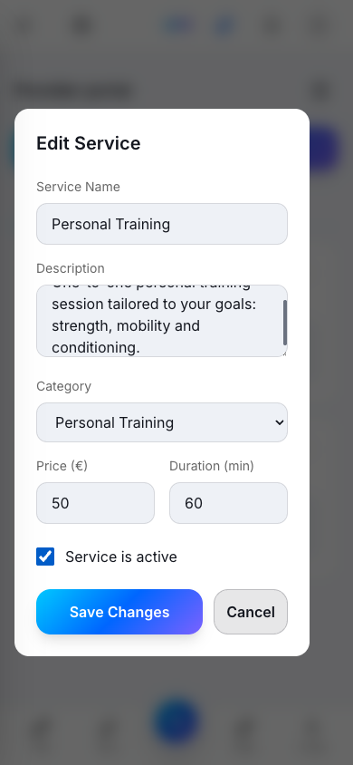

### A10. The service is live

*Personal Training* now shows **€50 / 60 min** with no *Inactive* badge. The provider appears in search results with **From 50,00 €**.

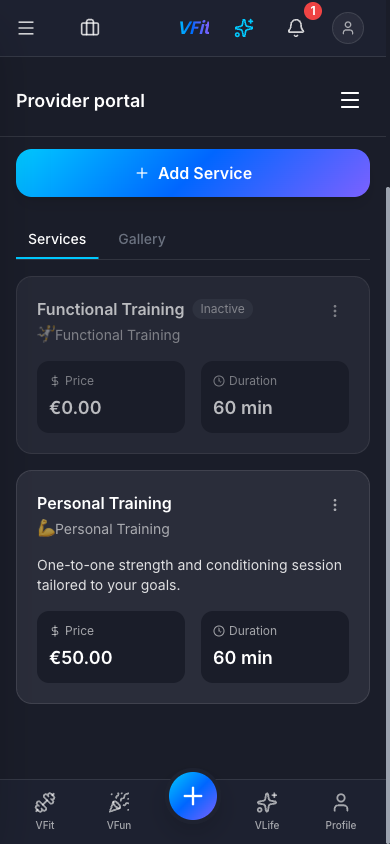

### A11. Availability (optional check)

**Provider portal → Availability** shows the weekly schedule created at signup: Monday to Friday, one slot each (09:00–17:00), weekends off. It also has general settings:

- **Buffer Time**: 15 minutes
- **Min. Advance Notice**: 24 h
- **Max Bookings per Day**: 8
- **Timezone**: Europe/Rome

**Date Overrides** covers holidays and one-off changes.

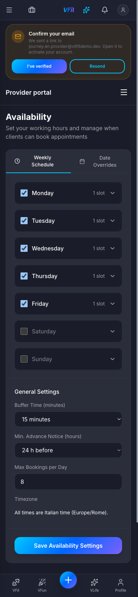

### A12. Location (recommended)

**Provider portal → Location** sets where the provider works. They search an address (here *Piazza del Duomo, Milano*), fine-tune the pin on the map and tap **Save location**. The confirmation reads *"Location saved: you now show up in 'near me' searches."* Only an approximate position (~100 m) is stored.

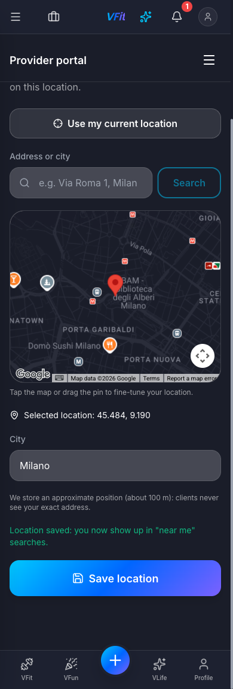

> **Why this step matters:** in the current build, **Near me** is the reliable way for a customer to find a brand-new provider (see [Issue 1](#issues-observed-during-the-walkthrough)).

*The provider is now live. [Part B](#part-b-customer-journey) shows the customer booking them. The provider's side then resumes at A13.*

### A13. New booking request notification

When the customer books, the bell shows an unread badge. **Notifications** shows *"New booking request — Giulia Verdi requested Personal Training (Fri, Oct 2, 10:00 AM). Accept or decline it in the app."*

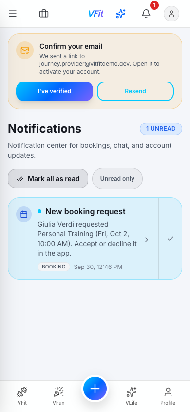

### A14. Bookings: the request awaiting confirmation

**Provider portal → Bookings** lists the request with client, service, date and time, price, status **AWAITING CONFIRMATION**, and the **Confirm** and **Decline** actions. The tabs filter by All, Pending, Confirmed, Completed and Cancelled.
(Shown at desktop width. On a phone the table scrolls sideways and the actions start off-screen; see [Issue 2](#issues-observed-during-the-walkthrough).)

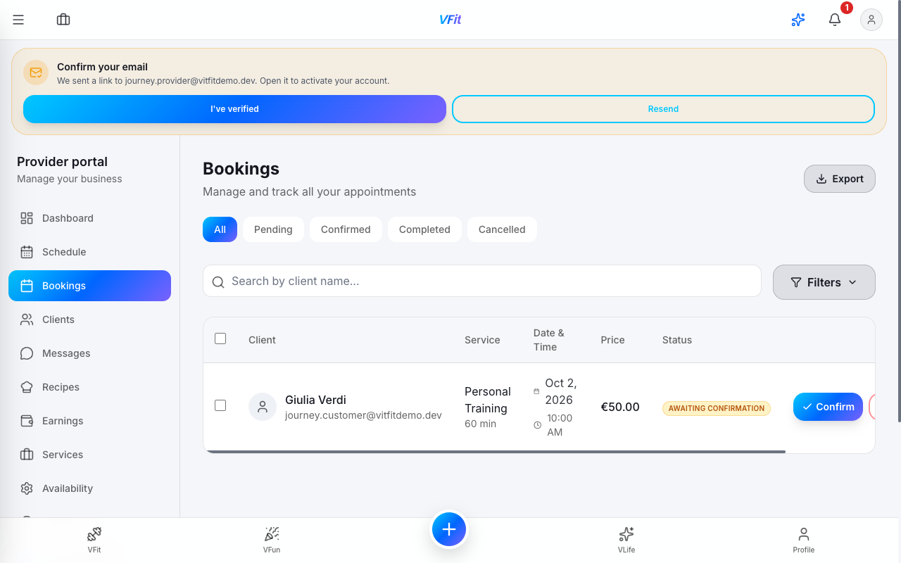

### A15. Confirm the booking

The provider taps **Confirm**. The status becomes **CONFIRMED** and the row action changes to **Complete**, which is used after the session. The customer is notified.

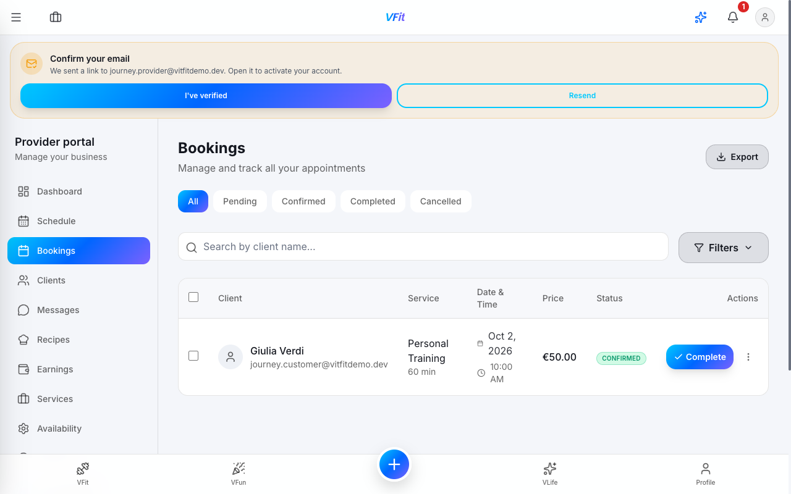

### A16. Dashboard: upcoming appointment

The dashboard now counts **1** under *This Week's Bookings*. *Upcoming Appointments* lists **Oct 2 · 10:00 AM · Giulia Verdi · Personal Training · Confirmed**.

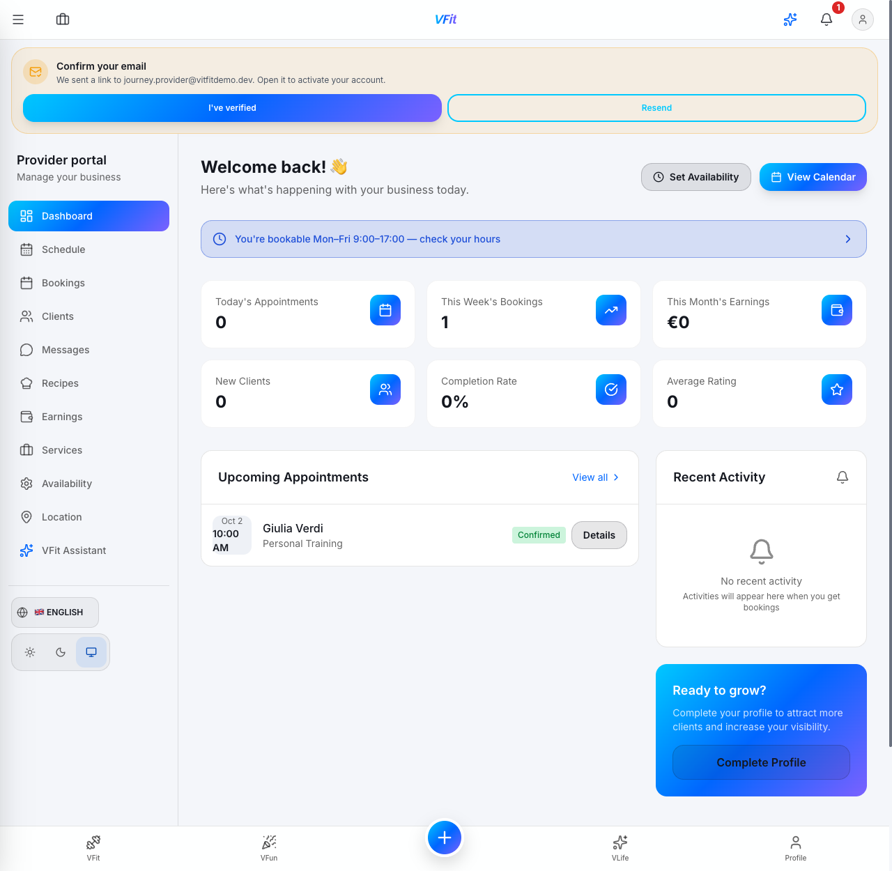

---

## Part B: Customer journey

### B1. Landing page

The visitor taps **Register as a customer**.

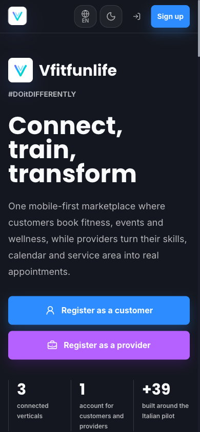

### B2. Choose a signup method

Customers choose how to sign up: **Email and Password**, **Google**, **Apple** or **Phone (SMS)**. This walkthrough uses email.

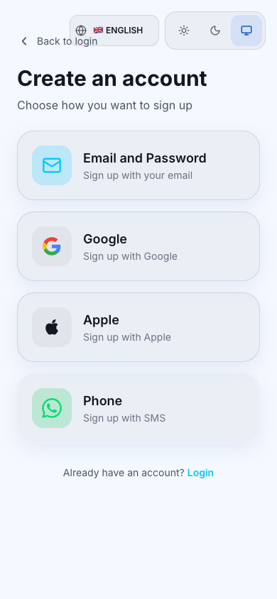

### B3. Signup form

This is the same form the provider used, but with the professional opt-in **unticked**.

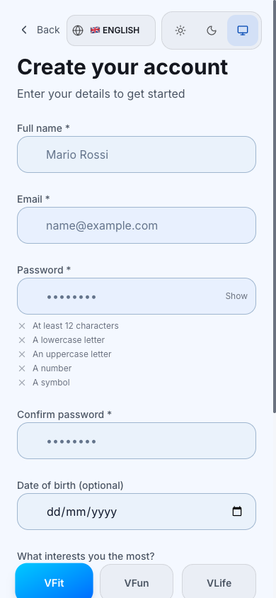

### B4. Fill in and create the account

The customer enters their name, email, a password that meets all five rules, an optional date of birth and their main interest (VFit). They accept the Terms of Service and Privacy Policy and tap **Create account**.

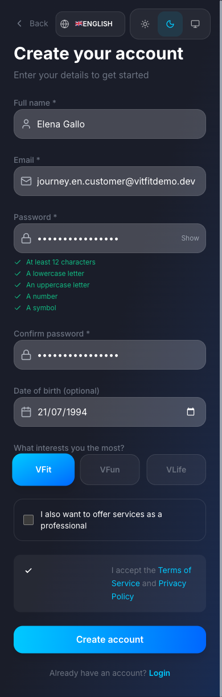

### B5. Permissions

This is the same optional Location and Notifications step as the provider's. The customer taps **Skip for now**. Allowing location here makes **Near me** one tap later.

### B6. Home

The customer lands on **Home**, which shows gyms and locations, active classes, the VFit map and *Find your online coach*. The same **Confirm your email** banner appears.

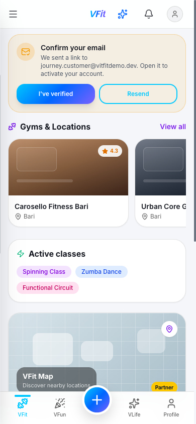

### B7. Book a service

The **Book now** button (centre of the bottom bar) or **Search** opens **Book a service** (`/booking`). The customer can:

- search by trainer or service name
- filter by category (Strength & Conditioning, Cardio & Endurance, Combat Sports, Mind & Body, Dance & Group, Therapy & Recovery, Nutrition & Lifestyle, Mental Wellness)
- use **Near me** with a radius (5 / 10 / 25 / 50 km / All)
- switch between list and map view

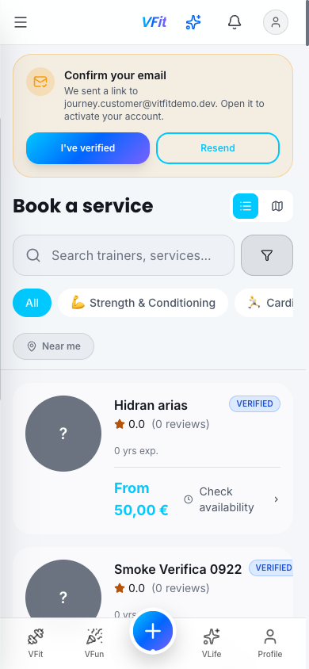

### B8. Find the trainer

The customer taps **Near me**, which uses the device location (here central Milan), and types the trainer's name. **Luca Bianchi** appears **0.1 km** away, marked **VERIFIED**, **From 50,00 €**. They tap **Check availability**.

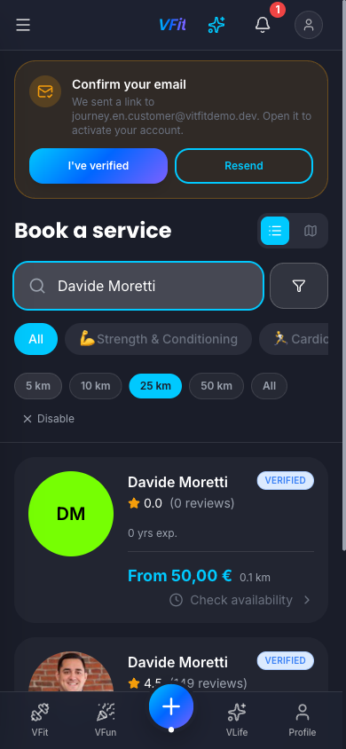

### B9. Trainer page: select a service

The trainer's page (`/book?providerId=…`) has **Services**, **Reviews** and **About** tabs and a **Message** button. Under *Select a service* the customer taps **Select** on *Personal Training (1 h, 50,00 €)*.

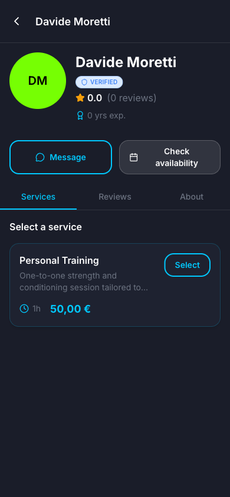

### B10. Pick a date

The calendar opens on the current month. Only days with free slots are enabled. The provider requires 24 h notice, so the customer moves to **October** with the › arrow and taps **Friday 2**.

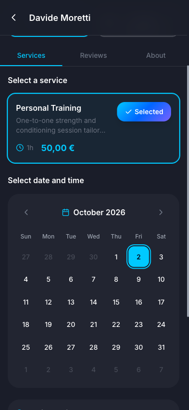

### B11. Pick a time

*Available times* lists the free 30-minute start times, grouped into **Morning** and **Afternoon** (Europe/Rome time). The customer picks **10:00**. The footer summarises *Personal Training · Fri, Oct 2 · 10:00*, and they tap **Continue**.

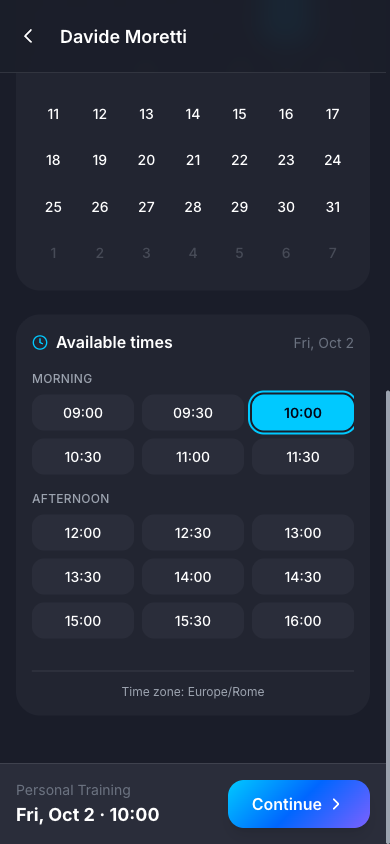

### B12. Confirm booking

The confirmation screen (`/booking/confirm`) shows:

- the trainer, service, date and time (Friday, October 2 · 10:00 · 60 min) and city (Milano)
- **Note for the trainer (optional)**, up to 500 characters
- **Promotional code** and **Use my points** (100 points = €1.00)
- **Price summary**: Service €50.00, Total €50.00
- **Pay your trainer**: nothing is paid in the app; the customer pays €50 directly, and earns +50 XP once the trainer records the payment after the session
- the **Terms of service** and **Cancellation policy** checkbox (*free cancellation within 24 hours*), which is required

The customer ticks the checkbox and taps **Confirm**.

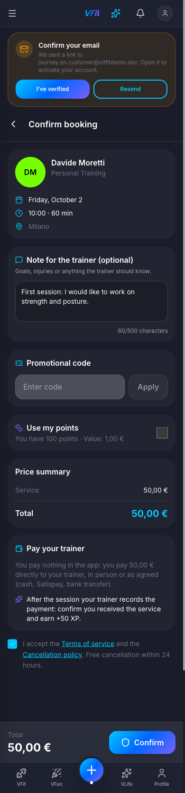

### B13. Request sent

The app opens the booking detail with a green banner: *"Request sent, waiting for the trainer. We'll let you know as soon as the trainer replies."*

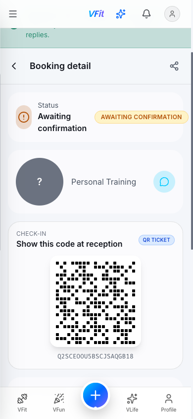

The booking detail shows:

- status **Awaiting confirmation**
- a **check-in QR ticket** to show at reception
- date and time, with **Add to calendar**
- the note left for the trainer
- payment status **PENDING**, total €50.00, **Download receipt**
- the booking ID and **Cancel booking**

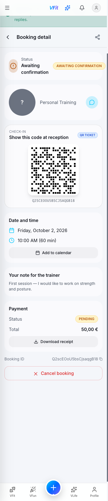

*The provider now accepts the request (steps [A13–A15](#a13-new-booking-request-notification)).*

### B14. Booking accepted notification

Once the trainer confirms, the customer gets *"Booking accepted — Your trainer accepted your request for Personal Training."*

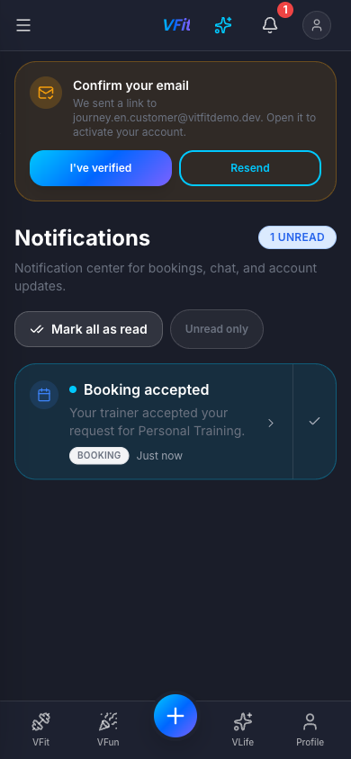

### B15. My bookings

**Bookings** (`/bookings`) has the tabs New, Upcoming, Past and Cancelled. It lists the session as **CONFIRMED · Personal Training · Oct 2, 10:00 AM**.

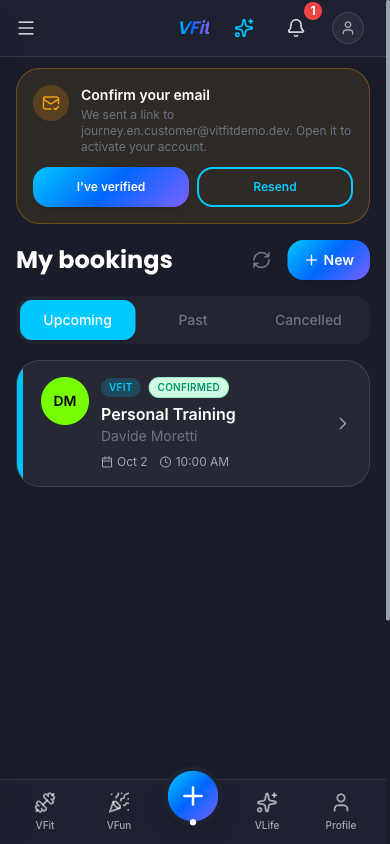

### B16. Booking detail: confirmed

The booking detail now shows status **Confirmed**. The QR check-in ticket, calendar export, receipt and cancellation option are still available.

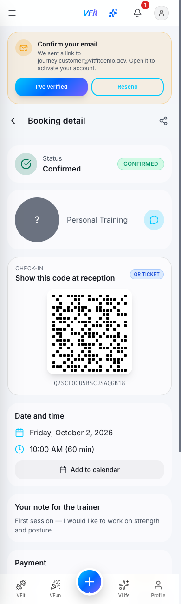

**The journey is complete:** both accounts were created and the appointment is booked and confirmed on both sides.

---

## Issues observed during the walkthrough

These came up while recording the journeys on 30 Sep 2026. They are listed for follow-up. None of them stopped the booking from going through.

| # | Severity | Where | What happened |
|--|--------|-----------|-------------------------------------|
| 1 | **High** | Book a service → search (`src/lib/firebookings.ts`, `searchProviders`) | **A brand-new provider cannot be found by name.** The search fetches the first 50 verified instructors *by document id* and only then filters by the text typed. Searching "Luca Bianchi" returned only an older seeded trainer with the same name. The new provider was reachable only through **Near me**, once they had set a location. A provider who skips the location step may not be findable by name at all. |
| 2 | Medium | Provider → Bookings, mobile | The bookings table scrolls sideways on a phone, so the **Confirm / Decline** buttons start off-screen and nothing hints that they are there. |
| 3 | Medium | Provider → Bookings | After tapping **Confirm**, the row still showed *Awaiting confirmation* ~5 s later. It showed *Confirmed* only after a page reload. There was no loading or success feedback in the meantime. |
| 4 | Medium | Customer → Booking detail | The trainer's **name is missing** from the booking card: it shows only a "?" avatar and the service name. The confirm screen does show it. |
| 5 | Low | Mobile provider portal | The sticky *Provider portal* header covers the top of the **Confirm your email** banner (its title and text are hidden). |
| 6 | Low | Time-slot picker | The selected slot (white text on light cyan) has low contrast and may fail WCAG AA. |
| 7 | Low | Console | `Query data cannot be undefined … ["user-bookings", <uid>]` (TanStack Query) on the customer's bookings, and a 404 for `/images/placeholder.jpg`. |
| 8 | Info | Staging | No verification email arrives on staging (email secrets are placeholders by design), so the *Confirm your email* banner stays up. It did not block signup, service setup or booking. |
| 9 | Info | E2E suite | The terms checkbox on the confirm screen is now a real `<input type="checkbox">`. `e2e/journey/journey.spec.ts` still clicks an unlabeled `<button>` inside `div.flex.items-start.gap-3` and may need updating (not run as part of this walkthrough). |

---

## Reproducing this walkthrough

1. Staging only lets in allowlisted emails. A superadmin adds them first at **Admin → Staging access** (`/admin/staging-access`).
2. Run the app locally against staging with `npm run dev` (`.env.local` points at `vfit-app-staging`). The staging gate is skipped on `localhost`, but sign-up is still checked against the allowlist on the server.
3. Follow Part A, then Part B, then A13–A16 and B14–B16.
4. To find the new provider, give the browser a location near theirs and use **Near me** (see Issue 1).
