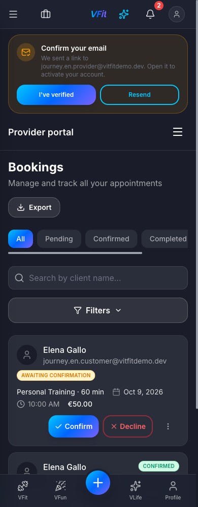
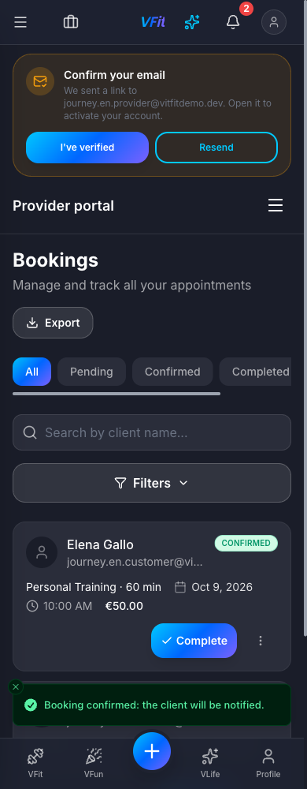
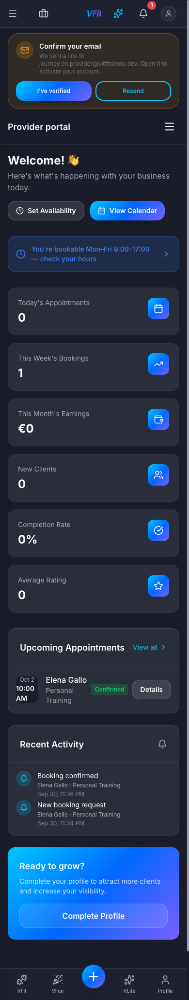

# VFit: Signup-to-Booking User Journeys

How a **provider** (trainer) and a **customer** get from creating an account to a confirmed appointment, step by step, with a screenshot of every screen.

*Italian version: [signup-to-booking.it.md](signup-to-booking.it.md).*

| | |
|--------|----------------------------|
| **Recorded** | 30 September 2026 (second recording, after the responsive pass), against the staging backend (`vfit-app-staging`), app built from `main` @ `9f9af27` |
| **Updated** | 1 October 2026: the screens changed by the UI fixes were re-shot on the deployed staging app (`main` @ `9a2fcae`), see [Re-shoot on 1 October 2026](#re-shoot-on-1-october-2026) |
| **Device** | Mobile viewport 390 × 844 (iPhone 12/13/14 size). Long screens are captured at full height |
| **Theme** | Dark |
| **Language** | English (the app also ships in Italian, Spanish, French and German) |
| **Provider used** | Davide Moretti, `journey.en.provider@vitfitdemo.dev` |
| **Customer used** | Elena Gallo, `journey.en.customer@vitfitdemo.dev` |
| **Resulting booking** | `Dfi6vOZj7RoHLRkQkNn0`: Personal Training, Fri 2 Oct 2026, 10:00–11:00, €50 |

Both accounts were created fresh for this walkthrough. Nothing in it was seeded or mocked.

> **About the 1 October re-shoot.** By then the Fri 2 Oct request had already been confirmed, so the screens that need an open request (B10–B13, A14–A15) were re-taken with a second request from the same customer to the same trainer: **Fri 9 Oct 2026, 10:00** (`zMF09KunKbRCmuyyTxiQ`), confirmed by the trainer and then cancelled by the customer. Those screenshots show Oct 9; the rest of the walkthrough is unchanged.

---

## The two journeys at a glance

The two journeys meet at the booking request. The provider must be live, with at least one active and priced service, before a customer can book them.

| # | Provider (trainer) | Customer |
|--|------------------|------------------|
| 1 | Opens the landing page → **Register as a provider** | Opens the landing page → **Register as a customer** |
| 2 | Fills in the signup form and ticks **I also want to offer services as a professional**, picking the services they offer | Chooses a signup method (email, Google, Apple, phone/SMS) and fills in the signup form |
| 3 | Is approved on the spot: role `provider`, verified, default Mon–Fri 09:00–17:00 hours, one inactive draft service per chosen category | Lands on Home |
| 4 | Sets a price on a draft service and activates it | Opens **Book a service**, finds the trainer (search, category or **Near me**) |
| 5 | Checks their availability and sets a location so they appear in **Near me** searches | Opens the trainer's page, picks a service, a date and a time slot |
| 6 | | Reviews the booking, accepts the terms and taps **Confirm**. The booking is created as a *request* |
| 7 | Gets a **New booking request** notification and **confirms** the booking | |
| 8 | Sees the appointment under *Upcoming Appointments* | Gets a **Booking accepted** notification. The booking shows as **Confirmed** |

**Booking status lifecycle covered here:** `requested` ("Awaiting confirmation") → `accepted` ("Confirmed"). The later statuses (completed, cancelled, reviewed) are outside the scope of this document.

**Payment:** at this stage customers pay the trainer directly, in person or as agreed (cash, Satispay, bank transfer). Nothing is charged in the app. After the session the trainer records the payment.

---

## Part A: Provider journey

### A1. Landing page

The visitor opens the app. The hero offers two entry points: **Register as a customer** and **Register as a provider**. The provider taps **Register as a provider**.


### A2. Signup form (provider mode)

**Register as a provider** opens `/auth/register?as=provider`. It goes straight to the email signup form, with the professional opt-in already ticked. A row at the top holds the language picker and the light / dark / system theme switch; the **Back** link sits below it.


### A3. Personal details

The provider enters:

- **Full name** and **Email** (required)
- **Password** and **Confirm password**. The live checklist requires at least 12 characters, a lowercase letter, an uppercase letter, a number and a symbol.
- **Date of birth** (optional)
- **What interests you the most?**: VFit, VFun or VLife (here: VFit)


### A4. Professional opt-in and services offered

With **I also want to offer services as a professional** ticked, the provider picks the services they offer from the platform catalogue. They choose a category (e.g. *Strength & Conditioning*) and then one or more services. Here: **Personal Training** and **Functional Training**. They tick the box to accept the Terms of Service and Privacy Policy (the ticked box is filled in the section colour, with the text right next to it) and tap **Create account**.


> **What happens behind the scenes.** Provider auto-approval is on by default (`systemSettings/providerOnboarding.autoApprove`, switchable on `/admin/providers`), so the `applyAsProvider` function approves the account immediately:
> role `provider`, verified provider profile, default Mon–Fri 09:00–17:00 availability, and one **inactive, €0 draft service** for each service picked. If an admin switches auto-approval off, the application goes to a pending queue instead.

### A5. Permissions

After signup the app asks for **Location** (to find nearby gyms, events and services) and **Notifications** (booking updates). Both are optional. The provider can allow them or tap **Skip for now**.


### A6. Provider dashboard

The provider lands directly in the **Provider portal**. The dashboard confirms they are already bookable (*"You're bookable Mon–Fri 9:00–17:00 — check your hours"*) and suggests adding a location. A **Confirm your email** banner above the *Provider portal* bar asks them to click the verification link sent to their inbox. It does not block anything in this journey.


*This screenshot is from 30 September and still shows the old greeting. A new provider is now greeted with **Welcome!** ("Welcome back!" only once they have delivered a session); see A16.*

### A7. Services: the drafts created at signup

**Provider portal → Services** lists one draft per service chosen at signup. Drafts are **Inactive** at **€0**, so customers cannot book them until the provider sets a price.


*Screenshots A7 and A8 are from 30 September (the draft state can't be recreated). Prices on the provider's screens are now written out in full, e.g. **€0.00** and **€50.00** (see A10).*

### A8. Open the service actions

The **⋮** menu on a service card offers **Edit**, **Duplicate**, **Activate** and **Delete**. The provider opens it on *Personal Training* and taps **Edit**.


### A9. Price and activate the service

In **Edit Service** the provider adds a description, sets **Price (€)** to **50** and keeps **Duration** at **60 min**. They tick **Service is active** and tap **Save Changes**. The dialog is centred on the phone; **Esc** or **Cancel** closes it without saving.
(New services can also be added with **Add Service**, either from the catalogue or as a custom service.)


### A10. The service is live

*Personal Training* now shows **€50.00 / 60 min** and its description, with no *Inactive* badge. The provider appears in search results with **From 50,00 €**.


### A11. Availability (optional check)

**Provider portal → Availability** shows the weekly schedule created at signup: Monday to Friday, one slot each (09:00–17:00), weekends off. It also has general settings:

- **Buffer Time**: 15 minutes
- **Min. Advance Notice**: 24 h
- **Max Bookings per Day**: 8
- **Timezone**: Europe/Rome

**Date Overrides** covers holidays and one-off changes.


### A12. Location (recommended)

**Provider portal → Location** sets where the provider works. They search an address (here *Piazza Gae Aulenti, Milano*), fine-tune the pin on the map, check the **City** and tap **Save location**. The confirmation reads *"Location saved: you now show up in 'near me' searches."* Only an approximate position (~100 m) is stored. The map follows the app theme: dark here, light in the light theme.


> Customers can find the provider by typing their name even without a location. The location adds them to **Near me** results and shows the distance.

*The provider is now live. [Part B](#part-b-customer-journey) shows the customer booking them. The provider's side then resumes at A13.*

### A13. New booking request notification

When the customer books, the bell shows an unread badge. **Notifications** shows *"New booking request — Elena Gallo requested Personal Training (Fri, Oct 2, 10:00 AM). Accept or decline it in the app."*


### A14. Bookings: the request awaiting confirmation

**Provider portal → Bookings** shows each booking as a card on a phone: client avatar, name and email, status **AWAITING CONFIRMATION** (under the name on a phone), service and duration, date, time and price, with the **Confirm** and **Decline** buttons always visible. The tabs filter by All, Pending, Confirmed, Completed and Cancelled; there is also a client-name search, **Filters** and **Export**.

*(Re-shot with the Oct 9 request; the confirmed Oct 2 booking is the card below it.)*



### A15. Confirm the booking

The provider taps **Confirm**. The button shows a spinner, then the card switches to **CONFIRMED** and a toast reads *"Booking confirmed: the client will be notified."* The card action becomes **Complete**, which is used after the session.



### A16. Dashboard: upcoming appointment

The greeting reads **Welcome!**, since the provider has not delivered a session yet. The dashboard counts **1** under *This Week's Bookings*. *Upcoming Appointments* lists **Oct 2 · 10:00 AM · Elena Gallo · Personal Training · Confirmed**, with a **Details** button. *Recent Activity* lists **Booking confirmed** and **New booking request** for *Elena Gallo · Personal Training*, newest first; each entry opens the booking.



---

## Part B: Customer journey

### B1. Landing page

The visitor taps **Register as a customer**.


### B2. Choose a signup method

Customers choose how to sign up: **Email and Password**, **Google**, **Apple** or **Phone (SMS)**. This walkthrough uses email.


### B3. Signup form

This is the same form the provider used, but with the professional opt-in **unticked**.


### B4. Fill in and create the account

The customer enters their name, email, a password that meets all five rules, an optional date of birth and their main interest (VFit). They accept the Terms of Service and Privacy Policy and tap **Create account**.


### B5. Permissions

This is the same optional Location and Notifications step as the provider's. The customer taps **Skip for now**. Allowing location here makes **Near me** one tap later.


### B6. Home

The customer lands on **Home**, which shows gyms and locations, active classes, the VFit map and *Find your online coach*. The same **Confirm your email** banner appears.


### B7. Book a service

The **Book now** button (centre of the bottom bar) or **Search** opens **Book a service** (`/booking`). The customer can:

- search by trainer or service name
- filter by category (Strength & Conditioning, Cardio & Endurance, Combat Sports, Mind & Body, Dance & Group, Therapy & Recovery, Nutrition & Lifestyle, Mental Wellness) and with **Filters**
- use **Near me** with a radius (5 / 10 / 25 / 50 km / All)
- switch between list and map view


### B8. Find the trainer

The customer taps **Near me**, which uses the device location (here near Porta Nuova, Milan) with a default radius of 25 km, and types the trainer's name. **Davide Moretti** appears first, marked **VERIFIED**, **From 50,00 €** with the distance (**0.1 km**) next to the price. (A seeded trainer with the same name shows up further down, 1.3 km away.) They tap **Check availability**.


### B9. Trainer page: select a service

The trainer's page (`/book?providerId=…`) has **Services**, **Reviews** and **About** tabs and the **Message** and **Check availability** buttons. Under *Select a service* the customer taps **Select** on *Personal Training (1 h, 50,00 €)*.


### B10. Pick a date

The calendar opens on the current month and the customer taps **Friday 2** (in the re-shot screenshot, **Friday 9**). Only days with at least one free slot can be tapped: weekends, days off and days inside the provider's 24 h notice period (here today, Thu 1) are greyed out. They pulse briefly while the calendar checks the month.


### B11. Pick a time

*Available times* lists the free 30-minute start times, grouped into **Morning** and **Afternoon** (Europe/Rome time). The customer picks **10:00**. The footer summarises *Personal Training · Fri, Oct 2 · 10:00* (*Fri, Oct 9* in the screenshot), and they tap **Continue**.


### B12. Confirm booking

The confirmation screen (`/booking/confirm`) shows:

- the trainer, service, date and time (Friday, October 2 · 10:00 · 60 min; October 9 in the screenshot) and city (Milano)
- **Note for the trainer (optional)**, up to 500 characters
- **Promotional code** and **Use my points** (100 points = 1,00 €)
- **Price summary**: Service 50,00 €, Total 50,00 €
- **Pay your trainer**: nothing is paid in the app; the customer pays 50,00 € directly, and earns +50 XP once the trainer records the payment after the session
- the **Terms of service** and **Cancellation policy** checkbox (*free cancellation within 24 hours*), which is required

The customer writes a note, ticks the checkbox and taps **Confirm**.


### B13. Request sent

The app opens the booking detail with a green banner: *"Request sent, waiting for the trainer. We'll let you know as soon as the trainer replies."*


The booking detail shows:

- status **Awaiting confirmation**, with the badge under the label
- the trainer's name and service, with a chat button to message the trainer
- a **check-in QR ticket** to show at reception
- date and time, with **Add to calendar**
- the note left for the trainer
- payment status **PENDING**, total 50,00 €, **Download receipt**
- the booking ID and **Cancel booking**


*The provider now accepts the request (steps [A13–A15](#a13-new-booking-request-notification)).*

### B14. Booking accepted notification

Once the trainer confirms, the customer gets *"Booking accepted — Your trainer accepted your request for Personal Training."*


### B15. My bookings

**My bookings** (`/bookings`) has the tabs Upcoming, Past and Cancelled, plus a refresh button and **+ New**. Under *Upcoming* it lists the session as **VFIT · CONFIRMED · Personal Training · Davide Moretti · Oct 2, 10:00 AM**, with the › chevron on the right of the card.


### B16. Booking detail: confirmed

The booking detail now shows status **Confirmed**. The QR check-in ticket, calendar export and receipt are still available, and the actions are now **Reschedule** and **Cancel booking**.


**The journey is complete:** both accounts were created and the appointment is booked and confirmed on both sides.

---

## What changed since the first recording

The first recording (earlier on 30 Sep 2026, light theme) found nine issues; issues 1–7 and 9 were fixed the same day (commit `fa4ec61`). This recording confirms the fixes that show up in the flow:

- **Search by name** finds a brand-new provider without a location (typing "Davide Moretti" with Near me off lists him).
- **Provider bookings on a phone** are cards with Confirm / Decline / Complete always visible, so A14–A16 are now shown at phone width instead of desktop width.
- **Confirm feedback**: the button shows a spinner, the card switches to *Confirmed* straight away and a toast confirms it.
- **Trainer name** appears on the customer's booking card and booking detail (initials avatar instead of "?").
- **Email banner** sits above the *Provider portal* bar instead of under it.
- **Selected time slot** uses dark text on the section colour.

Screens that differ from the first recording: the provider's booking screens (A14–A16) are the mobile card layout; *My bookings* has three tabs (Upcoming, Past, Cancelled) plus **+ New** instead of a *New* tab; the confirmed booking detail adds **Reschedule**; the booking detail has a chat button next to the trainer.

## Re-shoot on 1 October 2026

The issues found in this recording were fixed on 1 October 2026 (plan `docs/plans/2026-10-01-journey-ui-fixes-plan.md`, tasks F1–F9) and deployed to staging and production. The screens they changed were re-shot on staging, dark theme, 390 × 844:

- **Signup** (A2–A4, B2–B4): the language and theme controls are a row above the **Back** / **Back to login** link instead of covering it; the terms checkbox sits right next to its text and is filled when ticked.
- **Edit Service** (A9): centred on the phone, labelled fields, a real dialog that closes with Esc.
- **Provider prices** (A10, A14, A15): written out in full (€50.00; 50,00 € in Italian).
- **Location map** (A12): dark in the dark theme.
- **Provider bookings** (A14, A15): the client avatar is a proper circle; the status badge moves under the name on a phone.
- **Provider dashboard** (A16): **Welcome!** for a provider who has not delivered a session yet, and *Recent Activity* now lists the booking events.
- **Book a service** (B7, B8): the *VERIFIED* badge stays whole and the distance sits next to the price.
- **Booking calendar** (B10, B11): only days with at least one free slot can be picked.
- **Booking detail** (B13): the *AWAITING CONFIRMATION* badge sits under the status label instead of sticking out of the card.
- **My bookings** (B15): the › chevron is on the right of the card.

B12, B13a and B16 were re-taken along with them. The trainer page (B9) looked the same in the dark theme, so it was kept. A6, A7 and A8 were kept because their first-login state can't be recreated (see the notes under them).

## Issues observed during this walkthrough

None of these stopped the booking from going through. Issues 1–12 and 14 from the 30 September list are fixed (see above) and have been removed. The remaining item is kept as #1; #2–#7 were seen during the 1 October re-shoot.

| # | Severity | Where | What happened |
|--|--------|-----------|-------------------------------------|
| 1 | Info | Staging | No verification email arrives on staging (email secrets are placeholders by design), so the *Confirm your email* banner stays up. It does not block signup, service setup or booking. |
| 2 | Low | Customer screens (B7–B13) | In English, customer-side prices still use the Italian format (*From 50,00 €*, *Service 50,00 €*, *Value: 1,00 €*), while the provider's screens now show *€50.00*. |
| 3 | Low | Provider dashboard (A16) | *This Month's Earnings* is built by hand as `€0` (`provider/dashboard/page.tsx`), so in Italian it reads *€0* instead of *0 €*. |
| 4 | Low | Italian copy | The Notifications subtitle still says *"Centro notifiche per booking, …"* (`notifications.subtitle`). |
| 5 | Low | Book a service, Italian (B8) | The distance uses a decimal point (*0.1 km*) instead of *0,1 km*. |
| 6 | Low | Book a service (B8) | Accessibility: neither the result card nor its *Check availability* text is a link or button, so a keyboard or screen-reader user cannot open a trainer from the results. |
| 7 | Info | Booking detail, Cancel booking | Accessibility: the *Keep / Cancel* confirmation that opens from **Cancel booking** is not marked up as a dialog (no `role="dialog"`). |

---

## Reproducing this walkthrough

1. Staging only lets in allowlisted emails. A superadmin adds them first at **Admin → Staging access** (`/admin/staging-access`), or they are written to `stagingAllowlist/{email}` with the Admin SDK.
2. Run the app locally against staging with `npm run dev` (`.env.local` points at `vfit-app-staging`). The staging gate is skipped on `localhost`, but sign-up is still checked against the allowlist on the server.
3. Set dark theme with the theme switch (or `localStorage['vfit.theme'] = 'dark'`) and English with the language picker (`localStorage['vfit.locale'] = 'en'`).
4. Follow Part A, then Part B, then A13–A16 and B14–B16.
5. Regenerate the Word file (pandoc + Pillow; screenshots are sized like the first recording, 844 px = 14.1 cm, capped at 20 cm):

   ```bash
   cd docs/user-journeys
   python3 build-docx.py signup-to-booking.md signup-to-booking.docx \
     "VFit — Signup-to-Booking User Journeys" \
     "Provider and customer, from account creation to a confirmed appointment" en-US
   ```
